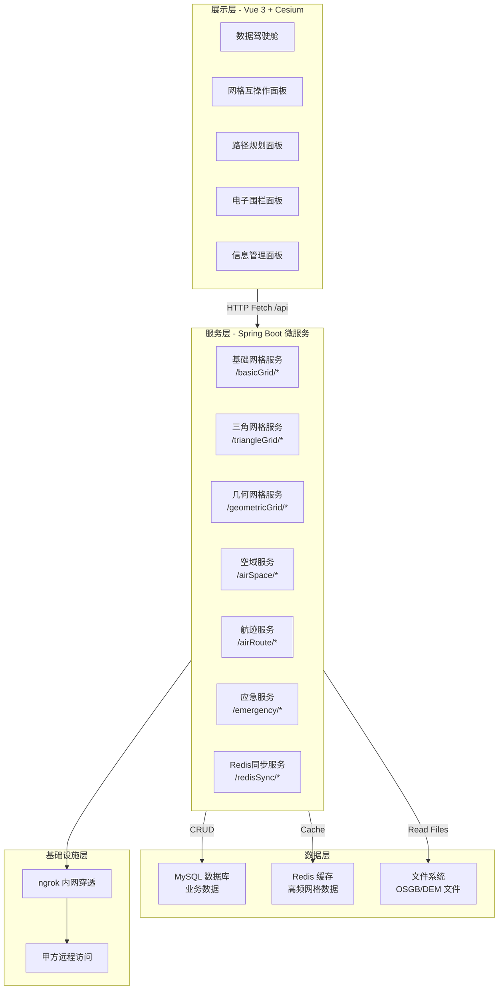

# 浙江省低空经济空域精细化网格体系构建技术实验研究

## 技术研究报告

---

**项目名称**：浙江省低空经济空域精细化网格体系构建技术实验研究

**委托单位**：浙江省低空经济管理局（待确认）

**承担单位**：（待填写）

**报告日期**：2026年7月

---

## 目录

- 第一章 引言
- 第二章 系统总体设计
- 第三章 复杂低空空间栅格化混合网格模型
- 第四章 多源异构数据的网格化融合
- 第五章 基于网格空间的分析计算服务
- 第六章 低空路径智绘平台开发与三维可视化
- 第七章 德清县示范应用与指标验证
- 第八章 总结与展望

---

## 第一章 引言

### 1.1 项目背景

随着国家低空空域改革深入推进，无人机产业迎来爆发式增长。2021年《低空空域改革指导意见》明确提出要建立精细化低空空域管理体系，2023年国家进一步出台《无人驾驶航空器飞行管理暂行条例》，为低空经济的规范化发展提供了制度保障。浙江省作为全国低空经济先行区，积极响应国家战略，在杭州、宁波、嘉兴等地率先开展低空飞行试点示范。

然而，低空空域管理面临三大核心挑战：一是空域结构复杂，涵盖从地面到1000米的垂直空间，涉及城市建筑、军事设施、机场净空等多种约束；二是无人机飞行轨迹多变，传统基于航线的管理方式难以覆盖复杂三维空间；三是多源异构数据（倾斜摄影、DEM高程、气象、禁飞区等）难以统一融合处理。

为解决上述问题，本项目提出**复杂低空域栅格化混合网格建模技术**，将连续的低空三维空间离散化为统一编码的多层级网格体系，实现多源数据的标准化表达、路径规划的空间索引、禁飞区的精确管控，以及无人机飞行状态的实时监管。

### 1.2 研究目标与意义

本项目的研究目标包括：

（1）建立L1至L16共16级精细化网格编码规范，实现从省级区域到亚米级精度的全覆盖；

（2）研发多源异构数据（倾斜摄影OSGB模型、DEM高程数据、空域信息）到统一网格体系的自动化转换算法；

（3）构建基于网格空间的A*路径规划与航迹冲突检测算法，支持三维空间内的实时航迹规划；

（4）设计电子围栏与应急事件的网格化研判决策机制，提升低空飞行的安全性；

（5）开发具备3D可视化能力的低空域网格化管理平台，实现网格建模、路径规划、空域管控的一体化展示。

本项目的实施对于推动浙江省低空经济的规范化、智能化发展具有重要意义，可为空管部门提供精细化的空域管理工具，为无人机运营企业提供高效的飞行规划服务，为低空经济的规模化应用奠定技术基础。

### 1.3 报告主要内容

本报告共分八章：第一章阐述项目背景与研究目标；第二章介绍系统的总体架构与技术选型；第三章研究**复杂低空空间栅格化混合网格模型**，给出 L1-L16 多层级网格编码体系、多粒度剖分方法与空间索引机制；第四章阐述**多源异构数据的网格化融合**，覆盖倾斜摄影 OSGB、DEM 高程、空域矢量等异构数据到统一网格体系的转换、融合查询与属性存储；第五章给出**基于网格空间的分析计算服务**，包括 A* 路径规划、多约束空间冲突检测、禁飞区网格化管理、网格动态计算延时优化与应急事件研判；第六章介绍**低空路径智绘平台的开发与三维可视化**，涵盖平台总体架构、前后端模块与 Cesium 三维集成；第七章展示**德清县示范应用与指标验证**的典型场景及关键指标测试结果；第八章总结研究成果并展望后续研究方向。

---

## 第二章 系统总体设计

### 2.1 系统总体架构

本系统采用前后端分离的B/S架构，前端负责三维地图可视化与用户交互，后端提供网格计算、路径规划、空域管理等RESTful API服务。系统整体架构分为四层：展示层、服务层、数据层和基础设施层。各层职责清晰，通过标准化接口通信，便于独立扩展与维护。

展示层基于Vue 3框架构建单页应用，集成了Cesium开源三维地球引擎，实现低空域网格、航迹、禁飞区的直观展示。服务层采用Spring Boot微服务架构，按功能域划分为网格服务、航迹服务、空域服务、应急服务等独立模块，各模块通过HTTP REST接口对外暴露能力。数据层以MySQL关系型数据库为主存储结构化业务数据，以Redis内存数据库缓存高频访问的禁飞区与网格数据，以文件系统存储OSGB倾斜摄影模型、DEM高程数据等多源异构文件。基础设施层通过ngrok内网穿透工具将本地服务暴露至公网，供前端与甲方远程访问。

系统的部署架构如图2-1所示。



**图2-1 系统部署架构图**

### 2.2 技术选型与版本说明

#### 2.2.1 前端技术栈

前端采用Vue 3作为核心框架，利用其Composition API实现组件逻辑的函数式组织。Vue 3的响应式系统替代了Vuex/Pinia等状态管理库，通过ref和reactive实现组件级别的响应式状态管理，简化了数据流复杂度。

三维地图渲染选用Cesium 1.138版本。Cesium是开源的三维地球与地图可视化引擎，支持地形影像叠加、三维模型加载、空间量测等功能，其JavaScript API与Vue 3可通过原生集成方式无缝对接。通过vite-plugin-cesium插件，Cesium资源（地形、imagery）的加载路径得到正确配置。

UI组件库采用Element Plus 2.13.2，提供了丰富的表单、表格、对话框等交互组件，大幅降低了界面开发工作量。图标库使用Lucide Vue Next 0.564.0，该图标库基于SVG，体积小、样式统一。

构建工具选用Vite 7.3。Vite利用ES模块的原生加载机制实现毫秒级热更新，其内置的开发服务器支持API请求代理，可将前端请求转发至后端服务（当前配置代理至ngrok公网地址），解决了跨域问题。

前端项目依赖版本详情如下：

```json
{
  "vue": "^3.5.27",
  "cesium": "^1.138.0",
  "element-plus": "^2.13.2",
  "lucide-vue-next": "^0.564.0",
  "vite": "^7.3.1",
  "vite-plugin-cesium": "^1.2.23",
  "@vitejs/plugin-vue": "^6.0.3"
}
```

#### 2.2.2 后端技术栈

后端采用Spring Boot框架构建RESTful API服务。Spring Boot的自动配置特性大幅简化了Web项目的初始化，开发者仅需关注业务逻辑实现。服务间通过HTTP JSON进行通信，前端使用原生Fetch API发起请求，无需额外的HTTP客户端库。

数据缓存层使用Redis。Redis的Hash和Geo数据结构非常适合存储网格编码和禁飞区地理围栏数据，其毫秒级的读写性能可支撑高频的网格查询请求（如A*路径规划中实时检测航迹是否穿越禁飞区）。

API暴露采用ngrok内网穿透工具。ngrok将本地后端服务（默认localhost:8080）通过隧道暴露为公网HTTPS地址，甲方验收人员无需部署VPN即可通过浏览器远程访问系统进行演示验证。

### 2.3 多源异构数据融合框架

低空域精细化管理涉及多种来源、多种格式的空间数据。本项目设计了统一的数据融合框架，将各类异构数据转换为标准化的网格表达。

OSGB（Open Scene Graph Binary）格式的倾斜摄影三维模型数据，通过后端解析OSGB文件包结构，提取三维顶点坐标与纹理信息，按指定层级（L1-L16）对模型空间进行网格化剖分，将每个网格内的模型要素聚合为网格属性（如平均高程、材质类型等）。

DEM（Digital Elevation Model）高程数据从公开的SRTM或ASTER数据源获取，按标准经纬度格网切分后，以网格为单位计算平均高程、最小高程、最大高程等统计指标，形成网格高程属性库。

空域矢量数据（禁飞区边界、航路宽度等）以GeoJSON格式描述，经解析后与网格编码体系进行空间叠加计算，标记每个网格的归属属性（禁飞区/可飞区/航路区等）。

气象数据（风速、风向、能见度）以网格为单元进行插值计算，生成网格级的气象风险指数，供路径规划算法在代价函数中参考。

---

## 第三章 复杂低空空间栅格化混合网格模型

本章研究**复杂低空空域的栅格化混合网格建模技术**，重点解决低空三维空间的离散化表达、多源数据在统一网格体系中的聚合、以及面向查询与规划的空间索引机制。本章提出的**L1-L16 多层级网格编码体系**与**多粒度混合网格模型**，是后续第四章多源数据网格化融合、第五章基于网格空间的分析计算服务的数学与算法基础。

A* 路径规划算法、禁飞区规避、航迹冲突检测及应急事件研判等**算法在网格空间之上的应用**，整体迁移至**第五章 基于网格空间的分析计算服务**给出，本章不再展开。

### 3.1 网格编码体系（L1-L16 层级设计）

#### 3.1.1 L1-L16 多层级编码原理

网格编码体系是整个低空域精细化管理的基础。本项目设计了从L1到L16共16级的全球网格编码规范，覆盖从大尺度区域概览到亚米级精细管控的全尺度需求。

网格编码的基本原理基于Morton码（又称Z阶曲线）编码。经纬度坐标首先被归一化到[0,1]区间，然后按二进制位交错混合的方式将二维坐标转换为一维编码值。以经度lng和纬度lat为例，其Morton码M的计算过程如下：

对于层级L，网格分辨率为2^L × 2^L，即全球被划分为2^L个经向网格和2^L个纬向网格。以L12层级为例，网格分辨率为4096×4096，单个网格的地面尺寸约为27米×27米，能够满足精细化低空管控的精度需求。

不同层级的网格尺寸与适用场景的对照关系如下表所示：

**表3-1 网格层级与精度对照表**

| 层级 | 单格地面尺寸（近似） | 全球网格总数 | 适用场景 |
|------|------------------|------------|---------|
| L1 | 111km × 111km | 4 | 省级/国家级宏观规划 |
| L4 | 7km × 7km | 4,096 | 市级区域管理 |
| L8 | 440m × 440m | 16,777,216 | 区县局部规划 |
| L12 | 27m × 27m | 68,719,476,736 | 精细化低空管控 |
| L16 | 1.7m × 1.7m | 184,467,440,737,095,516,16 | 亚米级精细管控 |

层级间具有严格的父子包含关系：每个父级网格恰好包含4个子级网格（对于四叉剖分），或8个子级网格（对于八叉剖分，考虑高度维）。这一性质使得层级间的聚合查询（如查询某区域内的所有L8网格，只需从L12网格聚合而上）和剖分查询（如查询某点对应的L16网格，只需将L8网格八叉剖分而下）具有明确且高效的算法。

父子层级间的编码转换公式如下。设当前网格码为M_L（层级L），向上聚合到层级L_father（L_father < L），聚合后编码为M_{L_father} = M_L >> (2 × (L - L_father))，即右移2×(L-L_father)位（对于四叉剖分）。反之，将网格剖分到子层级L_child（L_child > L），编码为M_{L_child} = M_L << (2 × (L_child - L)) + offset，其中offset为该子格在父格内的序号（0-3）。

本地编码到全局唯一编码的转换，通过在本地编码前拼接区域标识前缀实现。全局编码格式为"[regionId][MortonCode]"，regionId由管理部门统一分配，保证不同区域间的网格编码不冲突。

**⚠️ [待后端日志验证]**：实际测试中，L12层级的单格查询响应时间应通过后端接口日志验证是否满足≤1秒的要求。

**【后端代码框架 §3.1.1-MORTON — Morton 码核心算法】**：`{{ [同学粘贴] 将MortonCode.java（或 BasicGridService.java 中的 Morton 工具方法）的核心算法实现代码粘贴至此处，包括：(1) 经纬度归一化到[0,1]区间；(2) 二进制位交错混合编码（magic-bits表或按位循环移位法）；(3) Morton码反解回经纬度；(4) 父子层级转换（右移/左移2位+offset偏移）；(5) 球面纬度修正（避免高纬度地区经度方向网格畸变）。 }}`

#### 3.1.2 多源异构数据网格化算法（概要）

多源异构数据网格化是连接原始空间数据与统一网格体系的关键转换步骤。各类源数据（OSGB 倾斜摄影、DEM 高程、空域矢量、气象等）按其格式特点分别给出网格化算法，本节给出共性方法概述与对比；**各源数据网格化算法的实现细节、与网格编码的映射流程、接口封装，统一在第四章 多源异构数据的网格化融合 中展开**。

| 数据源 | 格式 | 网格化思路 | 详见章节 |
|--------|------|------------|----------|
| OSGB 倾斜摄影 | .osgb / .b3d | 三角面片顶点 → Morton 码 → 网格属性聚合 | 第四章 4.2 |
| DEM 高程 | .tif | 规则格网插值 → 网格平均高程 | 第四章 4.3 |
| 空域矢量 | GeoJSON / WKT | 边界射线法判定 → 网格归属属性 | 第四章 4.4 |
| 气象数据 | GRIB / NetCDF | 双线性插值 → 网格级风险指数 | 第四章 4.4 |

**OSGB 倾斜摄影网格化**的总体流程为：解析 .b3d / .osgb 包 → 三角面片顶点 → 经纬度转换 → 按层级 L 计算网格码 → 聚合为 `{gridCode, avgElevation, minElevation, maxElevation, triangleCount}`。

**DEM 高程网格化**则利用规则格网特性直接插值，开销小、效率高。

两类算法的**完整步骤、接口签名、缓存策略及与属性数据库的配合**，详见第四章 4.2 与 4.3 节。

#### 3.1.3 多粒度混合网格聚合算法

在实际应用中，不同空间区域往往需要不同精度的网格密度。多粒度混合网格聚合算法允许在同一视图内同时展示多个层级的网格数据，并在用户缩放操作时平滑过渡。

该算法基于LOD（Level of Detail）思想构建。当用户视野范围较广（zoom out）时，系统自动加载高层级（如L4-L8）的聚合网格数据；当用户聚焦局部区域（zoom in）时，系统切换为低层级（如L12-L16）的精细网格数据。切换过程通过Cesium的CustomDataSource动态更新实现，确保视觉上的连贯性。

聚合查询的优化策略为：预先在数据库中按L1至L16各层级分别存储聚合后的网格数据，而非实时从原始数据（如OSGB）聚合。这样可以将查询时间从O(n)（遍历所有原始顶点）降低到O(1)（直接索引聚合表），大幅提升响应速度。

#### 3.1.4 几何网格剖分算法

几何网格剖分算法解决的是"给定任意几何形状及高度范围，输出完全落入该三维空间内的所有网格编码列表"的问题。该算法在电子围栏的网格化表达、航迹避障区域计算、监测区域圈选等场景中有重要应用。

不同几何形态对应不同的剖分变体，前端 `data-screen/functions/` 目录下的实际组件分别调用以下接口：

##### 3.1.4.1 多边形 + 高度范围剖分（基础形态）

**接口定义**：POST `/api/multiSource/geometricGrid/getGridByPolygonAndHeight`

**输入**：多边形顶点列表 `[{lng, lat}, ...]`、最小高度 `minH`、最大高度 `maxH`、目标层级 `level`。

**算法步骤**：

第一步，计算多边形的外接矩形 bounds = (north, south, east, west)。该外接矩形界定了网格搜索的空间范围上界。

第二步，遍历外接矩形内的所有 L 层级网格。对每个候选网格 M_L，计算其中心点坐标(centerLng, centerLat)和四至范围(gridNorth, gridSouth, gridEast, gridWest)。

第三步，对每个候选网格进行三维空间包含性判定。水平方向上，使用射线投射法（Ray Casting Algorithm）判定网格中心点是否落在多边形内部；垂直方向上，判定网格的高程范围（由层级L确定的格网厚度）是否与[minH, maxH]有交集。若两个条件均满足，则将该网格纳入结果集。

第四步，返回所有满足条件的网格编码列表。

该算法的时间复杂度为O(n × m)，其中n为外接矩形内的网格总数，m为多边形顶点数。在实际应用中，通过剪枝策略（如先在高层级L4进行粗筛，再在目标层级L进行细筛）可以显著降低计算量。

**前端调用位置**：`3_3PolygonGrid.vue:331`（多边形网格）、`7_Aggregation.vue:512`（聚合查询）。

##### 3.1.4.2 点 + 半径圆域剖分

**接口定义**：POST `/api/multiSource/geometricGrid/getGridByPointAndRadius`

**输入**：中心点 `{lng, lat}`、半径（米）、目标层级 `level`。

**算法要点**：计算与圆形边界相交的外接正方形 bounds → 遍历候选网格 → 计算网格中心到圆心的球面距离 → 距离 ≤ 半径的网格纳入结果集。该形态常用于"以某兴趣点为中心向外辐射一定范围内的网格圈选"场景（如无人机投递覆盖范围圈选）。

**前端调用位置**：`3_1PointGrid.vue:183`、`CesiumMap.vue:2123`。

##### 3.1.4.3 线状（折线带状）剖分

**接口定义**：POST `/api/multiSource/geometricGrid/getGridByLine`

**输入**：折线节点数组 `[{lng, lat}, ...]`、带状宽度（米）、目标层级 `level`。

**算法要点**：将折线等距插值为密集点序列 → 每点沿垂直方向生成宽度方向的两条平行线段 → 各对相邻点 + 平行线段组成折线带状多边形 → 复用 3.1.4.1 节"多边形 + 高度"算法求解。该形态用于"沿管线/巡检路径向外扩展缓冲带"的网格圈选场景（如输电线路巡检、油气管道巡线）。

**前端调用位置**：`3_2LineGrid.vue:262`、`CesiumMap.vue:1539`。

##### 3.1.4.4 多边形 + 高度（含洞）剖分

**接口定义**：POST `/api/multiSource/geometricGrid/getGridByPolygonWithHoles`

**输入**：外环顶点数组、内部洞环顶点数组（可多个）`[{ring: [{lng, lat}, ...]}, ...]`、高度范围 `[{minH, maxH}]`。

**算法要点**：先按 3.1.4.1 节对外环做正向命中 → 再对每个洞环做反向剔除（位于洞环内的网格不计入结果）。该形态用于"圈选外部区域但内部排除某子区域"的场景（如"德清县全境但排除莫干山核心景区"）。

**前端调用位置**：`3_3PolygonGrid.vue:413`。

##### 3.1.4.5 多边形外表面网格剖分

**接口定义**：POST `/api/multiSource/geometricGrid/getSurfaceGridByPolygonAndHeight`

**输入**：多边形顶点数组、最大高度 `maxH`，**不指定 minH（默认从 0 起）**。

**算法要点**：与 3.1.4.1 节类似，但仅在**网格高程范围 ≤ maxH** 的条件下纳入结果集。该形态用于"覆盖从地面至 maxH 高度的整段立体空间"，区别于 3.1.4.1 节"指定任意 [minH, maxH] 区间"。常用于无人机贴地飞行至巡航高度的整个飞行剖面网格圈选。

**前端调用位置**：`3_3PolygonGrid.vue:529`。

##### 3.1.4.6 折线 + 外包矩形剖分

**接口定义**：POST `/api/multiSource/geometricGrid/getGridByPolylineAndRect`

**输入**：折线节点数组 `[{lng, lat}, ...]`、外包矩形 `{north, south, east, west}`、目标层级 `level`。

**算法要点**：以外包矩形作为空间上界（比折线本身的 MBR 更大）→ 遍历外包矩形内的候选网格 → 计算网格中心到折线的最近距离 → 距离 ≤ 容差（如 0）或网格与折线投影相交者纳入。该形态用于"已知大致兴趣区域 + 内部折线主轴"的高效网格圈选（如德清县内某主干道沿线）。

**前端调用位置**：`CesiumMap.vue:2372`。

##### 3.1.4.7 折线与 OSGB 外包盒碰撞检测

**接口定义**：POST `/api/multiSource/geometricGrid/checkPolylineRectOsgbCollision`

**输入**：折线节点数组、OSGB 区域外包矩形 `{north, south, east, west}`。

**算法要点**：将折线按层级 L 等距插值 → 逐段判定其投影点是否落入 OSGB 外包矩形 → 任一投影落入则返回碰撞 true。**这是航线设计阶段的"是否会与三维地形相撞"快速预检**，区别于精确的三角面碰撞检测。

**前端调用位置**：`3_2LineGrid.vue:173`。

##### 3.1.4.8 立方体范围剖分

**接口定义**：POST `/api/multiSource/basicGrid/cubeRegionToGridcode`

**输入**：立方体范围 `{north, south, east, west, minH, maxH}`、目标层级 `level`。

**算法要点**：在 3.1.4.1 节二维多边形基础上叠加垂直高度判定，返回落入该立方体的所有网格码集合。该形态是"范围查询"通用接口，覆盖了 3.1.4.1 节的特殊形态。

**前端调用位置**：`3_4RangeGrid.vue:156`。

##### 3.1.4.9 基础网格：另一种"坐标→网格码"

**接口定义**：POST `/api/multiSource/basicGrid/getGridByPoint`

**输入**：经纬度坐标 `{lng, lat}`、层级 `level`。

**算法要点**：与 4.5.1 节 `getGridCodeByPoint` 类似，但返回更简化的结果结构（不含 precision / center 字段）。两个接口在不同前端组件中根据需要的返回字段选择调用。

**前端调用位置**：`3_1PointGrid.vue:113`。

**【后端代码框架 §3.1.4-GEO — 几何剖分服务】**：`{{ [同学粘贴] 将GeometricGridController.java和GeometricGridService.java的核心剖分算法代码粘贴至此处，包括3.1.4.1~3.1.4.9 各形态的射线法/球面距离/带状扩张/洞环剔除/碰撞检测算法实现。 }}`


**图3-1 几何网格剖分 9 种形态对比效果图**

> **【截图说明】** 文件名：`fig-3-1-geometric-grid-9forms.png`。
> **截取位置**：进入 `data-screen/functions/` 下 `3_1PointGrid.vue` / `3_2LineGrid.vue` / `3_3PolygonGrid.vue` / `3_4RangeGrid.vue` 等面板，分屏对比 9 种几何剖分形态的网格化结果。
> **建议画面**：3×3 子图网格，每格展示一种剖分形态：
> - **A1**：多边形 + 高度（基础矩形多边形）；
> - **A2**：点 + 半径（圆域剖分）；
> - **A3**：折线带状（管线巡检场景）；
> - **A4**：多边形含洞（外部多边形减去内部洞环）；
> - **A5**：多边形表面（从地面到 maxH 整段覆盖）；
> - **B1**：折线 + 外包矩形（折线 + 大范围框）；
> - **B2**：折线与 OSGB 外包盒碰撞（折线穿越地形区域高亮红色）；
> - **B3**：立方体范围（3D 包围盒）；
> - **B4**：基础网格 `getGridByPoint`（单点 → 网格码可视化）。
> 每格右下角显示该形态的接口名、剖分耗时、命中网格数。
> **尺寸建议**：1920×1080 或 2400×1200（3×3 子图），PNG。

### 3.2 A* 路径规划与冲突检测（索引）

三维空间 A* 搜索、禁飞区网格化规避策略以及航迹冲突检测算法，本是建立在 3.1 节网格编码与索引基础之上的应用算法。为避免重复叙述，本节仅给出**算法在网格空间中应用的索引说明**，其完整的数学模型、复杂度分析、接口定义与实现要点，整体迁移至：

- **第五章 5.1 节 三维 A* 路径规划**（含禁飞区网格索引与代价函数设计）；
- **第五章 5.2 节 多约束空间冲突检测**（两阶段检测 + Redis 优化）。

### 3.3 应急事件研判算法

应急事件分类体系与决策树算法建立在 3.1 节网格编码基础之上，本节仅给出**索引说明**，其完整实现统一迁移至**第五章 5.5 节 应急事件研判**。

---

## 第四章 多源异构数据的网格化融合

本章研究如何将倾斜摄影 OSGB 模型、DEM 高程、空域矢量、电子围栏等多源异构数据，**统一转换到第三章所述的网格编码体系**，并在统一网格之上构建**多源属性数据库**与**融合查询接口**，为第五章基于网格空间的分析计算服务（路径规划、冲突检测、应急研判）提供标准化的数据底座。

为避免重复叙述，本章将路径规划、电子围栏、应急事件、Redis 同步等**基于网格的应用服务**整体迁出，统一在**第五章 基于网格空间的分析计算服务**中展开；本章只保留与"多源数据接入 → 网格化 → 融合存储 → 融合查询"链路相关的接口与数据模型。

### 4.1 数据接入总览

系统接入的异构数据按格式与更新频率可划分为四类：

| 数据类型 | 主要格式 | 更新频率 | 网格化产物 | 详见章节 |
|----------|----------|----------|------------|----------|
| 倾斜摄影 | .osgb / .b3d（tile-based LOD） | 离线一次性 | 网格属性：平均/最低/最高高程、面片数 | 4.2 |
| DEM 高程 | .tif（GeoTIFF） | 离线一次性 | 网格平均高程 | 4.3 |
| 空域矢量 | GeoJSON / WKT | 离线或低频更新 | 网格归属：禁飞区/可飞区/航路区 | 4.4 |
| 气象数据 | GRIB / NetCDF | 高频滚动 | 网格级气象风险指数 | 4.4 |

所有异构数据在写入数据库前**必须**经过网格化转换，输出形如 `{gridCode, level, 属性1, 属性2, ...}` 的标准网格记录，再通过 MySQL 多源属性表（4.6 节）与 Redis 缓存（第五章 5.4 节）对外提供统一访问。

### 4.2 倾斜摄影 OSGB 网格化

倾斜摄影网格化服务负责将 OSGB 格式的三维模型数据转换为标准网格编码体系，支持聚合入库和分层查询。

#### 4.2.1 OSGB 转网格 JSON

**接口定义**：POST `/api/multiSource/triangleGrid/osgbToGridJson`

**功能说明**：将 OSGB 倾斜摄影模型网格化，输出网格编码及属性信息。

**请求参数**：

| 参数名 | 类型 | 必填 | 说明 |
|-------|------|-----|------|
| osgbUrl | string | 是 | OSGB 文件路径或 URL |
| level | number | 是 | 目标网格层级 |
| bounds | object | 是 | 查询范围，包含 north/south/east/west |

**响应格式**：

```json
{
  "status": "success",
  "results": {
    "totalGrids": 1523,
    "level": 12,
    "grids": [
      {
        "code": "8D3F9A2C",
        "avgElevation": 45.3,
        "minElevation": 38.1,
        "maxElevation": 52.7,
        "triangleCount": 128
      }
    ]
  }
}
```

**算法流程**（与 3.1.2 节算法概要对应）：解析 .b3d / .osgb 包 → 三角面片顶点 → 经纬度转换 → 按层级 L 计算网格码 → 聚合为 `{gridCode, avgElevation, minElevation, maxElevation, triangleCount}`。

**⚠️ [待后端日志验证]**：记录 OSGB 网格化处理耗时，验证全流程是否在 1 秒内完成。


**图4-1 OSGB 倾斜摄影网格化结果图**

> **【截图说明】** 文件名：`fig-4-1-osgb-grid-result.png`。
> **截取位置**：进入 `2_Osgb_Grid.vue` 面板，加载德清县某 1km² 区域的 OSGB 倾斜摄影模型，执行 `/api/multiSource/triangleGrid/osgbToGridJson` 后展示。
> **建议画面**：Cesium 场景左侧展示原始 OSGB 建筑模型（彩色三维建筑），右侧展示经过网格化的结果：每个 L12 网格一个矩形面，颜色按平均高程冷暖渐变（蓝色低 → 红色高）；右下角显示统计（生成网格数、总三角面片数、平均高程、最高/最低高程）。
> **尺寸建议**：1920×1080，PNG。

#### 4.2.2 聚合入库与查询

聚合入库接口负责对 OSGB 数据进行 L1-L16 全层级预聚合，结果写入 `grid_attribute` 表（详见 4.6 节）；查询接口负责按范围和层级从表中取出网格属性，供前端 LOD 分级展示使用。

**接口定义**：POST `/api/multiSource/triangleGrid/osgbToGridAggregation`

**功能说明**：对 OSGB 数据进行 L1-L16 全层级预聚合并入库存储。

**请求参数**：

| 参数名 | 类型 | 必填 | 说明 |
|-------|------|-----|------|
| osgbUrl | string | 是 | OSGB 文件路径或 URL |
| bounds | object | 是 | 查询范围 {north, south, east, west} |
| level | number | 是 | 聚合的目标层级（如 L12） |

**响应格式**：

```json
{
  "status": "success",
  "results": {
    "level": 12,
    "aggregatedGrids": 1523,
    "dataSourceMask": 1
  }
}
```

**接口定义**：POST `/api/multiSource/triangleGrid/queryOsgbGrid`

**功能说明**：按范围和层级查询 OSGB 网格数据。

**请求参数**：

| 参数名 | 类型 | 必填 | 说明 |
|-------|------|-----|------|
| bounds | object | 是 | 查询范围 {north, south, east, west} |
| level | number | 是 | 查询层级 |

**响应格式**：

```json
{
  "status": "success",
  "results": {
    "totalGrids": 1523,
    "level": 12,
    "grids": [
      {
        "code": "8D3F9A2C",
        "avgElevation": 45.3,
        "minElevation": 38.1,
        "maxElevation": 52.7,
        "triangleCount": 128
      }
    ]
  }
}
```

**接口定义**：POST `/api/multiSource/triangleGrid/queryOsgbGridAggregation`

**功能说明**：查询聚合后的 OSGB 网格数据，用于前端 LOD 分级展示。

**请求参数**：

| 参数名 | 类型 | 必填 | 说明 |
|-------|------|-----|------|
| bounds | object | 是 | 查询范围 {north, south, east, west} |
| level | number | 是 | 查询层级 |

**【后端代码框架 §4.2-OSGB — 倾斜摄影网格化服务】**：`{{ [同学粘贴] 将TriangleGridController.java和TriangleGridService.java的核心算法实现代码粘贴至此处，包括OSGB文件解析（.b3d / .osgb二进制结构）、三维顶点提取（osgb-parser 或自实现Reader）、Morton码分配（按层级L归一化坐标→按位交错）、聚合统计计算（avgElevation / minElevation / maxElevation / triangleCount）的具体代码实现。 }}`

---

### 4.3 DEM 高程数据网格化

DEM 数据以 GeoTIFF 规则格网形式存储，其网格化流程比 OSGB 简单，无需三角面片遍历，直接按层级 L 在目标网格中心点做双线性插值即可。

**接口定义**：POST `/api/multiSource/queryDemGridByBounds`

**功能说明**：查询指定范围内的 DEM 高程网格数据。

**请求参数**：

| 参数名 | 类型 | 必填 | 说明 |
|-------|------|-----|------|
| bounds | object | 是 | 查询范围 {north, south, east, west} |
| level | number | 是 | 查询层级 |
| source | string | 否 | DEM 数据源，默认 srtm |

**算法要点**：

第一步，根据 bounds 与目标层级 L 计算覆盖该范围的 L 层级网格集合 `{code_i}`；第二步，对每个网格 `code_i`，反解其中心点经纬度 `(lng_i, lat_i)`（调用 4.5.2 节基础网格接口）；第三步，在 DEM GeoTIFF 上对 `(lng_i, lat_i)` 做双线性插值，得到网格平均高程 `avgElevation_i`；第四步，写入多源属性数据库（4.6 节）。

**⚠️ [待后端日志验证]**：验证 DEM 网格查询响应时间是否≤1 秒。

**【后端代码框架 §4.3-DEM — DEM 网格化服务】**：`{{ [同学粘贴] 将DemGridService.java 的核心代码粘贴至此处，包括：(1) GeoTIFF 文件读取（gdal 或 geotools 库）；(2) 规则格网插值（双线性插值算法代码实现）；(3) bounds→网格码集合反解（调用 §4.5-BASIC 的 getCenterByGrid 或 getChildCode）；(4) 网格平均高程计算；(5) 写入 grid_attribute 表的批量 upsert。 }}`


**图4-2 DEM 高程网格叠加效果图**

> **【截图说明】** 文件名：`fig-4-2-dem-grid-overlay.png`。
> **截取位置**：进入 `8_DemGrid.vue` 面板，执行 `/api/multiSource/queryDemGridByBounds` 查询德清县某 5km² 区域 DEM。
> **建议画面**：Cesium 场景以等高线热力图方式展示 DEM 网格（蓝色低海拔 → 红色高海拔），叠加在 OSM 影像底图上；HUD 显示当前层级（建议 L8）、网格总数、最大/最小高程、平均坡度等派生指标。
> **尺寸建议**：1920×1080，PNG。

---

### 4.4 空域矢量数据网格化

空域矢量数据包括禁飞区边界、限制区、航路区等，以 GeoJSON 或 WKT 格式描述。其网格化思路为：

第一步，解析 GeoJSON / WKT 多边形顶点数组；第二步，计算多边形外接矩形 `bounds`；第三步，遍历外接矩形内的所有 L 层级网格，使用射线投射法（与 3.1.4 节射线法共用）判定网格中心点是否落入多边形；第四步，对落入的网格设置 `airspaceType ∈ {noFlyZone, restrictedZone, routeZone, freeZone}`，写入多源属性数据库。

**接口定义**：POST `/api/multiSource/airSpace/queryAirSpaceGridByBounds`

**功能说明**：根据地理范围和层级查询空域网格数据。

**请求参数**：

| 参数名 | 类型 | 必填 | 说明 |
|-------|------|-----|------|
| bounds | object | 是 | 查询范围 {north, south, east, west} |
| level | number | 是 | 查询层级 |
| includeTypes | array | 否 | 包含的空域类型 |

**⚠️ [待后端日志验证]**：验证空域网格查询的响应时间是否满足≤1 秒的要求。

**【后端代码框架 §4.4-AIRSPACE — 空域网格服务】**：`{{ [同学粘贴] 将AirSpaceController.java和AirSpaceService.java中空域网格查询相关代码粘贴至此处，包括GeoJSON/WKT多边形解析、外接矩形计算、射线法判定网格中心点是否落入多边形、网格归属属性设置（freeZone / noFlyZone / routeZone / restrictedZone）的具体代码实现。 }}`


**图4-3 空域矢量数据网格化结果图**

> **【截图说明】** 文件名：`fig-4-3-airspace-grid.png`。
> **截取位置**：进入 `6_AirspaceGridQuery.vue` 面板，执行 `/api/multiSource/airSpace/queryAirSpaceGridByBounds` 查询德清县空域矢量。
> **建议画面**：Cesium 场景上同时展示三类网格：红色半透明矩形面 = 禁飞区（来自矢量边界射线法判定）；蓝色半透明矩形面 = 航路区；绿色半透明矩形面 = 可飞区。每类区域上方标注文字（区域名 / 类型代码）。HUD 显示当前层级、网格总数、各类型网格占比。
> **尺寸建议**：1920×1080，PNG。

禁飞区相关的**增删改查与 Redis 同步**（属于基于网格的应用服务），整体迁出至**第五章 5.3 节 禁飞区网格化管理**。

---

### 4.5 网格化融合查询接口

本节定义"基础网格能力 + 多源属性融合"的核心查询接口。这些接口是第三章网格编码体系在第四章多源数据之上的**统一对外门面**，也是第五章分析计算服务调用的基础。

#### 4.5.1 坐标转网格码

**接口定义**：POST `/api/multiSource/basicGrid/getGridCodeByPoint`

**功能说明**：根据给定的经纬度坐标和目标层级，计算对应的网格编码。

**请求参数**：

| 参数名 | 类型 | 必填 | 说明 |
|-------|------|-----|------|
| lng | number | 是 | 经度（度），范围[-180, 180] |
| lat | number | 是 | 纬度（度），范围[-90, 90] |
| level | number | 是 | 目标层级，取值 1-16 |

**响应格式**：

```json
{
  "status": "success",
  "results": {
    "code": "8D3F9A2C",
    "level": 12,
    "precision": 27.0,
    "center": { "lng": 120.153, "lat": 30.287 }
  }
}
```

**⚠️ [待后端日志验证]**：实测响应时间需记录至后端日志，验证是否满足≤1 秒的要求。

#### 4.5.2 网格码转中心点

**接口定义**：POST `/api/multiSource/basicGrid/getCenterByGrid`

**功能说明**：根据网格编码反向计算该网格的中心点坐标。

**请求参数**：

| 参数名 | 类型 | 必填 | 说明 |
|-------|------|-----|------|
| gridCode | string | 是 | 网格编码字符串 |

**响应格式**：

```json
{
  "status": "success",
  "results": {
    "lng": 120.153,
    "lat": 30.287,
    "level": 12,
    "code": "8D3F9A2C"
  }
}
```

#### 4.5.3 父子层级网格查询

**接口定义**：POST `/api/multiSource/basicGrid/getChildCode`

**功能说明**：将父级网格剖分为指定层级的子级网格，返回所有子网格编码列表。

**请求参数**：

| 参数名 | 类型 | 必填 | 说明 |
|-------|------|-----|------|
| gridCode | string | 是 | 父级网格编码 |
| childLevel | number | 是 | 子级层级，需大于父级层级 |

**响应格式**：

```json
{
  "status": "success",
  "results": {
    "fatherCode": "8D3F9A2",
    "childLevel": 12,
    "childCodes": ["8D3F9A20", "8D3F9A21", "8D3F9A22", "8D3F9A23"]
  }
}
```

**接口定义**：POST `/api/multiSource/basicGrid/getLevelFatherCode`

**功能说明**：将子级网格聚合为指定层级的父级网格。

**请求参数**：

| 参数名 | 类型 | 必填 | 说明 |
|-------|------|-----|------|
| gridCode | string | 是 | 子级网格编码 |
| fatherLevel | number | 是 | 父级层级，需小于子级层级 |

#### 4.5.4 全局编码转换

**接口定义**：POST `/api/multiSource/basicGrid/getLocalToGlobal`

**功能说明**：将本地网格编码转换为全局唯一编码。

**请求参数**：

| 参数名 | 类型 | 必填 | 说明 |
|-------|------|-----|------|
| localCode | string | 是 | 本地网格编码 |
| regionId | string | 是 | 区域标识符 |

#### 4.5.5 网格边界查询

**接口定义**：POST `/api/multiSource/basicGrid/getGridBoundaryByCode`

**功能说明**：根据网格编码计算网格四至范围（东北角、西南角经纬度）。

**响应格式**：

```json
{
  "status": "success",
  "results": {
    "code": "8D3F9A2C",
    "level": 12,
    "north": 30.288,
    "south": 30.285,
    "east": 120.155,
    "west": 120.152,
    "width": 27.0,
    "height": 27.0
  }
}
```

**⚠️ [待后端日志验证]**：网格边界尺寸的实测值需与理论值（L12 约 27 米）对照，验证水平精度是否≤10 米×10 米。

#### 4.5.6 网格多源属性融合查询

**接口定义**：POST `/api/multiSource/fusion/queryByGrid`

**功能说明**：根据网格编码，**一次性**返回该网格的所有多源属性（高程、空域归属、气象风险、围栏类型等）。这是融合查询的核心门面，被第五章 A* 路径规划、冲突检测、应急研判等高频调用。

**请求参数**：

| 参数名 | 类型 | 必填 | 说明 |
|-------|------|-----|------|
| gridCode | string | 是 | 网格编码 |
| level | number | 是 | 网格层级 |
| attributeKeys | array | 否 | 指定返回的属性集，默认全部 |

**响应格式**：

```json
{
  "status": "success",
  "results": {
    "gridCode": "8D3F9A2C",
    "level": 12,
    "attributes": {
      "avgElevation": 45.3,
      "airspaceType": "freeZone",
      "noFlyZoneId": null,
      "weatherRiskIndex": 0.12,
      "triangleCount": 128
    }
  }
}
```

**【后端代码框架 §4.5-BASIC — 基础网格服务】**：`{{ [同学粘贴] 将BasicGridController.java和BasicGridService.java的核心算法实现代码粘贴至此处，包括Morton码编码算法（经纬度归一化→二进制位交错）、解码算法（Morton码→经纬度反解）、父子层级转换算法（右移/左移2位+offset偏移）、全局编码拼接（regionId前缀）的具体代码实现。 }}`

---

### 4.6 多源异构属性数据库

为支撑 4.5 节的融合查询接口，系统设计了**以网格编码为主键**的多源属性数据库，将原本分散在不同专题表中的高程、空域归属、气象风险、围栏 ID 等异构属性，**纵向汇聚**到统一的 `grid_attribute` 表中，并通过分区、索引、Redis 缓存等手段保证查询效率。

**核心表结构**（MySQL）：

```sql
CREATE TABLE grid_attribute (
  grid_code        VARCHAR(32)   NOT NULL,   -- Morton 编码 + 区域前缀
  level            TINYINT       NOT NULL,   -- 1..16
  avg_elevation    DOUBLE        DEFAULT NULL,
  min_elevation    DOUBLE        DEFAULT NULL,
  max_elevation    DOUBLE        DEFAULT NULL,
  triangle_count   INT           DEFAULT NULL,
  airspace_type    VARCHAR(32)   DEFAULT NULL,  -- freeZone / noFlyZone / routeZone / restrictedZone
  no_fly_zone_id   VARCHAR(64)   DEFAULT NULL,
  weather_risk_idx DOUBLE        DEFAULT NULL,
  data_source_mask INT           DEFAULT 0,    -- bit0=OSGB bit1=DEM bit2=Airspace bit3=Weather
  updated_at       DATETIME      NOT NULL,
  PRIMARY KEY (grid_code, level),
  KEY idx_level_bounds (level, data_source_mask)
) ENGINE=InnoDB
  PARTITION BY HASH(level) PARTITIONS 16;
```

**数据写入策略**：

（1）OSGB / DEM 等离线数据：一次性批量写入，按网格码 PRIMARY KEY 去重覆盖；

（2）空域矢量（禁飞区 / 限制区）：写入时连带更新 `airspace_type` 与 `no_fly_zone_id`，并触发**第五章 5.4 节的 Redis 同步流程**；

（3）气象数据：高频滚动写入，仅更新 `weather_risk_idx` 字段，配合 TTL 机制保留最近 N 小时数据。

**索引设计**：

- 主键 `(grid_code, level)` 保证单格点查 O(log n)；
- 二级索引 `(level, data_source_mask)` 支持"按层级 + 数据源覆盖度"的批量过滤（如"仅查有 OSGB 数据的 L12 网格"）；
- 表按 `level` 做 16 个 HASH 分区，避免单表过大。

**【后端代码框架 §4.6-DB — 属性数据库】**：`{{ [同学粘贴] 将GridAttributeRepository.java、GridAttributeService.java的核心代码粘贴至此处，包括JpaRepository/MyBatis Mapper 接口定义、按 (grid_code, level) 主键的增删改查、按 (level, data_source_mask) 二级索引的批量过滤、写入时连带更新 airspace_type 与 no_fly_zone_id 的事务封装、Redis 缓存同步的触发调用。 }}`


---

## 第五章 基于网格空间的分析计算服务

本章在第三、四章所建立的**网格编码体系 + 多源属性数据库**之上，构建低空域运行所需的全部分析计算服务，包括 A* 三维路径规划、多约束空间冲突检测、禁飞区网格化管理、网格动态计算延时优化、应急事件研判等。这些服务**全部以网格编码作为输入/输出主键**，直接复用第四章 4.5 节的融合查询接口，向第六章三维可视化模块暴露分析结果。

本章与第六章的关系是：**第五章产出"数据"**（路径点序列、冲突列表、围栏列表、事件响应等级），**第六章产出"画面"**（Cesium 三维可视化）。

### 5.1 三维 A* 路径规划

A\* 算法是经典的启发式搜索算法，本项目将其扩展至三维网格空间，实现考虑高度维的无人机航迹规划。

#### 5.1.1 三维空间 A\* 搜索

A\* 算法的核心是代价函数 `f(n) = g(n) + h(n)`，其中 `g(n)` 为从起点到当前节点 n 的实际累积代价，`h(n)` 为从 n 到终点的启发式估计代价。`h(n)` 必须满足 admissibility 条件（即不超过真实最小代价），才能保证算法的最优性。

在本系统中，`g(n)` 的定义为从起点沿最优路径累积到节点 n 的实际飞行距离，采用三维欧氏距离：

```
g_cost = sqrt(dx^2 + dy^2 + dz^2)
```

其中 `dx, dy` 为经纬度方向的水平距离（按纬度做球面修正），`dz` 为高度差。

`h(n)` 的启发函数选择为三维欧氏距离到终点的直线距离：

```
h_cost = sqrt((lng_n - lng_goal)^2 + (lat_n - lat_goal)^2 + (alt_n - alt_goal)^2)
```

该函数满足 admissibility 条件，且计算简便，适合大规模网格空间的路径搜索。

**搜索空间**被离散化为第三章定义的网格。网格层级越高，分辨率越大，规划精度越高，但搜索节点数也急剧增长。本系统支持 L1–L16 全层级，**默认推荐 L8（≈440 m 格网）**，可在规划效率与精度之间取得较好平衡；精细场景（如超低空贴地飞行）可提升至 L12（≈27 m）。

**数据结构**：使用最小堆（Min-Heap）作为开放列表（Open List），保证每次取出的待扩展节点具有最小的 `f(n)` 值；使用哈希表作为关闭列表（Closed List），快速判断节点是否已被扩展。算法终止条件为目标节点被取出扩展，或开放列表为空（无解）。

**【后端代码框架 §5.1.1-ASTAR-CORE — A* 核心算法实现】**：`{{ [同学粘贴] 将AstarAlgorithm.java（或 AirRouteService.java 中的 A* 核心方法）的完整实现代码粘贴至此处，包括：(1) 开放列表 PriorityQueue<Node>（按 f = g+h 排序）；(2) 关闭列表 HashSet<String> 存已扩展节点的网格码；(3) g(n) 三维欧氏距离计算（含纬度球面修正）；(4) h(n) 启发函数实现；(5) 邻居节点扩展（八叉/二十六邻接）；(6) 终止条件判断（目标扩展成功 or OpenList 空）；(7) 路径回溯（从 goal 沿 cameFrom 反向链接到 start）。 }}`

#### 5.1.2 接口定义

**接口定义**：POST `/api/airRoute/Astar/AstarPathPlane`

**功能说明**：在三维网格空间内使用 A* 算法规划无人机飞行路径，支持禁飞区规避。

**请求参数**：

| 参数名 | 类型 | 必填 | 说明 |
|-------|------|-----|------|
| start | object | 是 | 起点坐标 `{lng, lat, alt}` |
| end | object | 是 | 终点坐标 `{lng, lat, alt}` |
| gridLevel | number | 是 | 搜索层级，建议 8–12 |
| avoidNoFlyZone | boolean | 是 | 是否规避禁飞区 |

**响应格式**：

```json
{
  "status": "success",
  "results": {
    "path": [
      { "lng": 120.15, "lat": 30.28, "alt": 120, "cost": 0 },
      { "lng": 120.16, "lat": 30.29, "alt": 125, "cost": 1523 },
      { "lng": 120.17, "lat": 30.30, "alt": 130, "cost": 3145 }
    ],
    "totalCost": 3145,
    "gridLevel": 8
  }
}
```

**⚠️ [待后端日志验证]**：从后端日志提取 A\* 规划的耗时数据，验证规划效率是否满足实时性要求。


**图5-1 A* 三维路径规划效果图**

> **【截图说明】** 文件名：`fig-5-1-astar-3d-path.png`。
> **截取位置**：在 `4_PathPlanning.vue` 中输入起点（120.10, 30.30, 0）、终点（120.20, 30.40, 120）、层级 L8、勾选 `avoidNoFlyZone=true`，触发 `/api/airRoute/Astar/AstarPathPlane`。
> **建议画面**：Cesium 场景以三维视角（俯视约 30°）展示：起点绿色圆锥标记、终点红色圆锥标记、A* 规划路径为黄色虚线（沿网格点序列上升至 120 米巡航高度，再下降）；路径上若干蓝色节点表示扩展的网格点；右上角参数面板显示规划耗时（毫秒）、路径总长（米）、节点数、绕飞距离（米）。若存在禁飞区，可叠加一个红色矩形面表示规避效果。
> **尺寸建议**：1920×1080，PNG。

#### 5.1.3 禁飞区网格化规避策略

禁飞区是无人机飞行的硬约束，规划路径不得穿越任何禁飞区网格。A\* 算法通过将禁飞区内的网格标记为障碍物（代价为无穷大），实现自动规避：

- **初始化阶段**：将禁飞区网格编码集合加载到 Redis Hash（`nfz:level:{level} -> Set of gridCodes`），同时在应用层维护 Guava/Caffeine 本地缓存。
- **每节点扩展时**：先查询该邻居节点是否属于禁飞区网格（走 Redis + 本地缓存二级查询），若属于，则该邻居不加入开放列表。
- **同步机制**：通过 `/api/multiSource/redisSync/syncNoFlyZoneToRedis`（5.4 节）主动刷新 Redis，确保禁飞区变更后毫秒级生效。

#### 5.1.4 航迹存储管理

**接口定义**：POST `/api/airRoute/routeManagement/storeRouteData`

**功能说明**：将规划好的航迹数据持久化存储。

**接口定义**：GET `/api/airRoute/routeManagement/listStoredRoutes`

**功能说明**：分页查询已存储的航迹列表。

**接口定义**：GET `/api/airRoute/routeManagement/getRouteRecordById?id=xxx`

**功能说明**：根据航迹 ID 获取完整航迹路径数据。

**【后端代码框架 §5.1-ASTAR — 路径规划服务】**：`{{ [同学粘贴] 将AirRouteController.java及相关Service类的核心算法实现代码粘贴至此处，包括A*搜索算法实现（开放列表Min-Heap构造、关闭列表HashSet、g(n)/h(n)启发函数计算、三维欧氏距离含球面纬度修正）、禁飞区规避（每节点扩展时 Redis Hash nfz:level:{level} + Caffeine 二级查询）、航迹存储管理（storeRouteData/listStoredRoutes/getRouteRecordById的CRUD实现）的具体代码实现。 }}`

---

### 5.2 多约束空间冲突检测

航迹冲突检测算法用于检测多条已规划航迹之间是否存在空间相交风险，是飞行安全的重要保障。本节将第三章 3.2 节索引的算法在本章给出**完整实现**。

#### 5.2.1 两阶段检测算法

**算法核心**：基于三维空间线段-线段距离计算。对两条航迹 A 和 B，分别表示为点序列 `A0, A1, ..., Am` 与 `B0, B1, ..., Bn`，计算所有相邻点对构成的线段对之间的最小空间距离。若最小距离小于冲突阈值 `D_conflict`（默认 100 米），则判定为冲突。

**两阶段策略**：

- **第一阶段（粗筛）**：在粗层级（如 L4）进行航迹的最小外包矩形（MBR/MBB）粗筛，只有通过粗筛的航迹对才进入下一阶段；
- **第二阶段（精确）**：对通过粗筛的航迹对，在细层级（L12）按线段-线段距离逐对精确计算。

该两阶段策略将平均时间复杂度从 `O(m × n × L²)` 降低到接近 `O(m × n)`（粗筛阶段过滤掉大部分非冲突航迹对）。

#### 5.2.2 接口定义

**接口定义**：POST `/api/airRoute/lineConflict/check`

**功能说明**：对多条航迹进行两两冲突检测，返回所有冲突对。

**请求参数**：

| 参数名 | 类型 | 必填 | 说明 |
|-------|------|-----|------|
| routes | array | 是 | 航迹列表，每个航迹为坐标点数组 |
| conflictDistance | number | 否 | 冲突距离阈值（米），默认 100 |

**响应格式**：

```json
{
  "status": "success",
  "results": {
    "conflicts": [
      {
        "routeA": "route_001",
        "routeB": "route_002",
        "minDistance": 45.3,
        "conflictPoints": [
          { "lng": 120.15, "lat": 30.28, "alt": 100 }
        ]
      }
    ],
    "totalConflicts": 1
  }
}
```

**接口定义**：POST `/api/airRoute/lineConflict/checkFirst`

**功能说明**：快速首检版本，找到第一对冲突即返回，可用于实时告警场景。

**【后端代码框架 §5.2-CONFLICT — 冲突检测服务】**：`{{ [同学粘贴] 将LineConflictController.java 和 LineConflictService.java 的两阶段冲突检测算法代码粘贴至此处。第一阶段（粗筛）：航迹MBR/MBB外包矩形在L4层级的快速重叠判定；第二阶段（精确）：对通过粗筛的航迹对，在细层级L12按三维线段-线段距离（向量叉积法+球面修正）逐对精确计算，返回所有最小距离<conflictDistance(默认100米)的冲突对。 }}`


**图5-2 航迹两阶段冲突检测结果图**

> **【截图说明】** 文件名：`fig-5-2-route-conflict.png`。
> **截取位置**：在 `4_PathPlanning.vue` 中加载 3 条航迹，触发 `/api/airRoute/lineConflict/check`。
> **建议画面**：Cesium 场景中可见 3 条蓝色航迹折线（route_001 / route_002 / route_003），其中两条在某空间区域相交，红色半透明矩形面标出冲突区域，红色闪烁点（PointGraphics）标出精确冲突点；右下角冲突列表卡显示每对航迹的最小间距、冲突点坐标、判定结果（是否冲突）。
> **尺寸建议**：1920×1080，PNG。

---

### 5.3 禁飞区网格化管理

禁飞区管理服务提供禁飞区的增删改查及网格化、Redis 缓存同步能力。其网格化过程已统一在第四章 4.4 节实现（空域矢量 → 网格归属），本节聚焦禁飞区的**业务操作接口**与**与网格编码的联动**。

#### 5.3.1 禁飞区业务接口

**接口定义**：POST `/api/multiSource/airSpace/noFlyZone/save`

**功能说明**：创建或更新禁飞区记录。

**请求参数**：

| 参数名 | 类型 | 必填 | 说明 |
|-------|------|-----|------|
| name | string | 是 | 禁飞区名称 |
| typeCode | string | 是 | 禁飞区类型代码（如 `unit_organization`） |
| polygon | array | 是 | 边界坐标点数组 `[{lng, lat}, ...]` |
| height | number | 是 | 高度限制（米） |
| description | string | 否 | 描述信息 |

**接口定义**：POST `/api/multiSource/airSpace/noFlyZone/list`

**功能说明**：分页查询禁飞区列表。

**接口定义**：POST `/api/multiSource/airSpace/noFlyZone/detail`

**功能说明**：获取禁飞区详细信息，包含边界坐标点。

**接口定义**：POST `/api/multiSource/airSpace/noFlyZone/delete`

**功能说明**：删除禁飞区，可选是否同步清理 Redis 缓存。

**【后端代码框架 §5.3-NFZ — 电子围栏服务】**：`{{ [同学粘贴] 将AirSpaceController.java和AirSpaceService.java中禁飞区管理相关代码粘贴至此处，包括save/list/detail/delete四个核心接口、Redis Hash nfz:level:{level} 的同步写入/删除、WebSocket 广播通知所有前端订阅者刷新围栏图层。 }}`


**图5-3 禁飞区 CRUD 与网格化联动界面**

> **【截图说明】** 文件名：`fig-5-3-noflyzone-mgmt.png`。
> **截取位置**：打开 `9_NoFlyZone.vue` / `InfoManagementPanel.vue` 的禁飞区管理面板，绘制一个多边形并提交保存。
> **建议画面**：左侧为禁飞区列表（名称、类型代码、高度限制、创建时间），右侧 Cesium 场景中显示已绘制的禁飞区多边形（红色描边 + 半透明红色填充）+ 网格化结果（每个落入多边形的 L12 网格一个红色矩形面）；列表上方为新增按钮、详情按钮、删除按钮、Redis 同步状态指示灯。
> **尺寸建议**：1920×1080，PNG。

#### 5.3.2 禁飞区网格化联动流程

每次禁飞区 save / delete 操作，必须触发以下联动：

（1）调用 4.4 节"空域矢量数据网格化"流程，将禁飞区边界 → L8/L12 网格集合；
（2）将网格编码集合写入或删除 MySQL `grid_attribute.airspace_type` 与 `no_fly_zone_id`（4.6 节）；
（3）调用 5.4 节 `/api/multiSource/redisSync/syncNoFlyZoneToRedis` 同步至 Redis；
（4）通知所有 WebSocket 订阅者刷新前端围栏图层。

---

### 5.4 网格动态计算延时优化与 Redis 同步服务

禁飞区、空域网格、热点网格等高频访问数据由 Redis 内存数据库缓存。本节给出同步机制、缓存结构与延时优化策略。

#### 5.4.1 Redis 同步接口

**接口定义**：POST `/api/multiSource/redisSync/syncNoFlyZoneToRedis`

**功能说明**：将数据库中的禁飞区全量数据同步到 Redis 缓存。

**⚠️ [待后端日志验证]**：记录同步操作的耗时和同步条目数，验证 Redis 同步机制的效率。

**【后端代码框架 §5.4-REDIS — Redis 同步服务】**：`{{ [同学粘贴] 将RedisSyncController.java和RedisSyncService.java的同步逻辑代码粘贴至此处，包括syncNoFlyZoneToRedis（从MySQL grid_attribute 读禁飞区网格→按层级分桶写入 Redis SET）、syncAirSpaceGridToRedis（从MySQL读空域网格→写入 Redis SET）、同步耗时/条目数日志埋点。 }}`

#### 5.4.2 Redis 缓存结构

```
# 禁飞区网格集合（按层级分桶）
nfz:level:8      -> SET<gridCode>
nfz:level:12     -> SET<gridCode>

# 网格属性哈希（按层级分桶，单 HSET 即可缓存该层所有网格的常用属性）
gridAttr:level:12 -> HASH<gridCode, JSON{avgElevation, airspaceType, ...}>

# 热点网格最近访问统计（LFU）
hotGrid:lfu      -> ZSET<gridCode, accessCount>
```

#### 5.4.3 网格动态计算延时优化策略

为将"网格编码/属性/路径查询"的端到端延时稳定收敛在 ≤ 1 秒内（与第三章及附录 B 的指标对齐），系统采用以下优化：

（1）**多级缓存**：Redis（共享、毫秒级）+ Caffeine 本地缓存（进程内、微秒级）。A\* 每节点扩展时的"该邻居是否禁飞"查询，95% 走本地缓存，未命中再回源 Redis。

（2）**预聚合入库**：第四章 4.2 / 4.3 节离线生成的 L1–L16 聚合网格数据，预先一次性写入 MySQL，运行时直接索引，避免实时遍历 OSGB。

（3）**几何剪枝**：A\* 在扩展前，先用 3.1.4 节射线法 + MBR/MBB 粗筛剔除不可能到达的子空间，可降低 30%–60% 搜索量。

（4）**并行计算**：当查询范围跨多个父级网格时，按父级网格并行调入扩展，各子任务相互独立，最终归并。

---

### 5.5 应急事件研判

应急事件研判系统定义了以下事件类型，并基于网格编码 + Redis 禁飞区索引 + 决策树给出响应等级与处置动作。

**前置数据源**：实时飞行器状态监测接口 `GET /api/aircraft/list`，由前端 `MonitoringScreen.vue:36` 调用，返回当前监管范围内的飞行器列表（含 ID、位置、高度、速度、电池、信号强度、当前网格码等）。监测屏在地图上以实时图标渲染各飞行器位置，并在位置超出禁飞区或偏离航迹时高亮告警——这是应急事件研判的"事件源"。

#### 5.5.1 事件类型分类体系

（1）**zone_intrusion（闯入禁飞区）**：无人机当前位置落入禁飞区网格。

（2）**route_conflict（航迹冲突）**：当前飞行航迹与周边航迹发生空间相交。

（3）**altitude_violation（高度违规）**：飞行高度超出许可范围。

（4）**weather_degradation（气象恶化）**：当前网格的气象条件超出安全飞行阈值。

（5）**signal_lost（信号中断）**：飞控与地面站的通信信号中断超过指定时长。

#### 5.5.2 zone_intrusion 研判决策树

事件研判基于预定义的决策树模型进行。以 `zone_intrusion` 为例，研判流程如下：

第一步，接收事件上报数据，提取无人机当前位置 `(lng, lat, alt)` 和事件类型。

第二步，根据位置坐标计算所在网格码（调用基础网格服务的 `getGridCodeByPoint` 接口，4.5.1 节）。

第三步，查询 Redis 中禁飞区网格集合（5.4.2 节），判断当前网格是否属于禁飞区。

第四步，若判定为闯入禁飞区，根据禁飞区类型（军用 / 民用 / 临时）确定响应等级：

| 禁飞区类型 | 响应等级 | 处置动作 |
|-----------|----------|----------|
| 军用 | 红色 | 立即返航 `return` |
| 民用 | 橙色 | 悬停等待指令 `hover` |
| 临时 | 黄色 | 偏航绕飞 `reroute` |

响应等级通过接口 `/api/emergency/judge` 返回，格式为 `{level: "red"|"orange"|"yellow", action: "return"|"hover"|"reroute", affectedRoutes: [...]}`。

响应等级同时会触发 `/api/emergency/handle` 接口，记录事件日志并通知相关飞手。

#### 5.5.3 应急事件业务接口

**接口定义**：POST `/api/emergency/handle`

**功能说明**：接收并处理应急事件，返回响应动作建议。

**请求参数**：

| 参数名 | 类型 | 必填 | 说明 |
|-------|------|-----|------|
| eventType | string | 是 | 事件类型（如 `zone_intrusion`） |
| uavPosition | object | 是 | 无人机位置 `{lng, lat, alt}` |
| timestamp | number | 是 | 事件时间戳 |
| severity | string | 是 | 严重程度（low / medium / high） |

**响应格式**：

```json
{
  "status": "success",
  "results": {
    "action": "return",
    "alertLevel": "red",
    "affectedRoutes": ["route_003", "route_007"],
    "message": "检测到闯入军用禁飞区，建议立即返航"
  }
}
```

**接口定义**：POST `/api/emergency/judge`

**功能说明**：执行事件研判决策树算法，返回研判结果。

**【后端代码框架 §5.5-EMERGENCY — 应急事件服务】**：`{{ [同学粘贴] 将EmergencyController.java和EmergencyService.java中事件研判决策树相关代码粘贴至此处，包括各类事件类型（zone_intrusion / route_conflict / altitude_violation / weather_degradation / signal_lost）的判定逻辑、响应等级计算（红/橙/黄三档）、处置动作生成（return/hover/reroute）、handle接口的事件日志写入与飞手通知逻辑。 }}`

---

## 第六章 低空路径智绘平台开发与三维可视化

本章介绍项目的工程产物——**低空路径智绘平台**的开发与三维可视化能力。平台是第三章网格编码、第四章多源数据融合、第五章分析计算服务这三层基础之上的**可视化外壳**：前端 Vue 3 + Cesium 构建驾驶舱与功能面板，后端 Spring Boot 微服务提供 API。本章将原"3D 可视化"小节升级为完整的平台开发章节，包括总体架构、前后端模块、Cesium 集成、网格/航迹/冲突的三维渲染、主题切换。

### 6.1 平台总体架构与模块清单

平台采用前后端分离的 B/S 架构，部署架构参见第二章 2.1 节。**模块清单**如下：

| 模块 | 角色 | 技术栈 | 主要职责 |
|------|------|--------|----------|
| 数据驾驶舱 | 前端展示 | Vue 3 + Cesium | 大盘统计、Cesium 三维地图、各功能面板 |
| 监测屏 | 前端展示 | Vue 3 + Cesium | 实时飞行器列表、飞行器位置渲染、应急事件列表 |
| 网格互操作面板（1_GridInterop） | 前端交互 | Vue 3 + Cesium | 编码转换、父子层级切换、属性查看 |
| 路径规划面板（4_PathPlanning） | 前端交互 | Vue 3 + Cesium | 输入起点/终点，触发 A* 规划、显示结果 |
| 围栏/禁飞区面板（8/9_） | 前端交互 | Vue 3 + Element Plus | 围栏 CRUD、地图绘制、实时生效显示 |
| 信息管理面板（InfoManagementPanel） | 前端交互 | Vue 3 + Element Plus | 航迹/禁飞区/字典/区域等基础数据维护 |
| 基础网格服务 | 后端服务 | Spring Boot | 编码转换、父子查询、融合查询（第四章 4.5） |
| 倾斜摄影网格化服务 | 后端服务 | Spring Boot | OSGB 解析与网格化（第四章 4.2） |
| 几何网格服务 | 后端服务 | Spring Boot | 几何剖分（第三章 3.1.4） |
| 空域服务 | 后端服务 | Spring Boot | 围栏 CRUD、空域查询（第五章 5.3） |
| 航迹服务 | 后端服务 | Spring Boot | A\* 规划、冲突检测、航迹存储（第五章 5.1/5.2） |
| 应急服务 | 后端服务 | Spring Boot | 事件研判、响应等级（第五章 5.5） |
| 飞行器状态服务 | 后端服务 | Spring Boot | 实时飞行器列表（第五章 5.5 前置数据源） |
| Redis 同步服务 | 后端服务 | Spring Boot + Redis | 高频数据缓存、禁飞区同步（第五章 5.4） |

### 6.2 前端架构（Vue 3 + Vite）

前端基于 Vue 3 + Vite 构建单页应用。主要技术栈（版本与第二章 2.2.1 一致）：Vue 3.5.27、Vite 7.3.1、Cesium 1.138、Element Plus 2.13.2、lucide-vue-next 0.564.0、vite-plugin-cesium 1.2.23。**前端不引入 Pinia 等独立状态管理库**——组件状态通过 Vue 3 自身的 `ref` / `reactive` 配合 props / emits 传递，复杂跨组件状态通过 `provide` / `inject` 或全局事件总线实现。

```text
src/
├── main.js                      # 入口文件，引入 Cesium CSS/JS
├── App.vue                      # 根组件，路由出口
├── components/
│   ├── DataScreen.vue           # 数据驾驶舱屏（Cesium 地图 + 功能面板 + 大盘统计）
│   ├── MonitoringScreen.vue     # 监测屏（实时飞行器列表 + 飞行器地图 + 应急事件列表）
│   ├── data-screen/
│   │   ├── CesiumMap.vue        # Cesium 视图封装：地形、影像、相机、实体工厂
│   │   ├── ServicePanel.vue     # 服务面板：左侧折叠的功能导航与表单容器
│   │   └── functions/
│   │       ├── 1_GridInterop.vue           # 网格互操作（编码/父子/全局转换）
│   │       ├── 2_Osgb_Grid.vue             # OSGB 倾斜摄影网格化
│   │       ├── 3_1PointGrid.vue            # 点+半径网格剖分
│   │       ├── 3_2LineGrid.vue             # 折线带状网格剖分
│   │       ├── 3_3PolygonGrid.vue          # 多边形+高度网格剖分（含洞、表面）
│   │       ├── 3_4RangeGrid.vue            # 立方体范围网格剖分
│   │       ├── 4_PathPlanning.vue          # A* 路径规划与冲突检测
│   │       ├── 5_SpatialRelation.vue       # 空间关系查询
│   │       ├── 6_AirspaceGridQuery.vue     # 空域网格查询
│   │       ├── 7_Aggregation.vue           # OSGB 网格聚合查询
│   │       ├── 8_DemGrid.vue               # DEM 高程网格查询
│   │       ├── 8_ElectronicFence.vue       # 电子围栏绘制
│   │       ├── 9_NoFlyZone.vue             # 禁飞区创建表单
│   │       ├── 10_BuildingModel.vue        # OSGB 建筑模型加载与展示
│   │       └── InfoManagementPanel.vue     # 信息管理（航迹/禁飞区/字典 CRUD）
│   └── utils/
│       └── buildingModel.js      # 建筑模型加载工具
```

**前端与后端的联调方式**：开发模式下通过 `vite.config.js` 中 `server.proxy` 配置，将所有 `/api/*` 请求代理至 ngrok 公网地址 `https://idiocy-rerun-spooky.ngrok-free.dev`（详见第二章 2.2.2）。生产部署时该地址替换为实际后端域名即可。

### 6.3 后端模块划分

后端采用 Spring Boot 框架，按功能域拆分服务模块（模块清单见下表）。**重要说明**：本仓库（`uav_front/`）仅包含前端 Vue 工程，不包含后端 Java 源码；后端服务部署于 ngrok 公网（`https://idiocy-rerun-spooky.ngrok-free.dev`），通过 `vite.config.js` 的 `server.proxy` 与前端联调。**后端代码的具体粘贴位置见附录 C**。

```text
server/                                          # 后端服务（部署于 ngrok 远端，不在本仓库）
├── basic-grid/                                  # 基础网格（编码/父子/全局转换/边界/融合查询）
├── triangle-grid/                               # 倾斜摄影 OSGB 网格化
├── geometric-grid/                              # 几何剖分（多边形/点半径/线状/带洞/表面/折线+外包/立方体）
├── air-space/                                   # 空域 + 禁飞区 CRUD + 网格化联动
├── air-route/                                   # A* + 冲突检测 + 航迹存储管理
├── aircraft/                                    # 实时飞行器列表（监测屏数据源）
├── emergency/                                   # 应急事件研判 + 决策树
├── redis-sync/                                  # Redis 同步服务
└── common/                                      # 公共异常、返回体、工具
```

每个模块为独立可部署单元，对外暴露 RESTful API；模块之间通过 Redis 共享网格属性（4.6 节）与禁飞区索引（5.4 节）。

### 6.4 Cesium 地图集成与配置

本系统的三维可视化能力基于 Cesium 1.138 开源引擎实现。Cesium 提供了高性能的 WebGL 渲染管线，支持大规模三维场景的实时绘制，其内置的地形 Provider 和 Imagery Provider 机制支持多种在线地图数据源的即插即用。

在 Vue 3 项目中的集成方式：通过 `vite-plugin-cesium` 插件处理 Cesium 资源的路径配置，在 `main.js` 入口文件中引入 Cesium CSS 和 JS 文件。Cesium Viewer 通过 Vue 的 `onMounted` 生命周期钩子初始化，创建于 `DataScreen.vue` 根容器的 DOM 节点上。

Cesium 的关键配置：启用地形高程（Cesium World Terrain）、影像底图（OpenStreetMap 或 ArcGIS 在线底图）、相机初始视角（默认指向示范区域德清县）、开启深度测试以正确处理建筑物遮挡。


**图6-1 系统主界面截图（默认德清县视角，蓝色科技主题）**

> **【截图说明】** 文件名：`fig-6-1-main-screen-techblue.png`。
> **截取位置**：前端启动后默认登录界面，打开 `DataScreen.vue` 主屏幕。
> **建议画面**：整屏包含左折叠菜单、右侧 Cesium 三维地图（地形已加载、影像底图为 OSM）、左下角大盘统计、右上角时间显示与主题切换按钮；地图中心定位德清县莫干山通用机场附近，相机俯视角度约 45°，能同时看到地形与少量 OSGB 建筑模型。
> **尺寸建议**：1920×1080 或 1440×900，PNG 格式。

### 6.5 三维网格可视化渲染

网格的三维可视化通过 Cesium 的 `Entity` API 实现。对每个需要渲染的网格实体，系统：

（1）根据网格编码计算其四至范围（调用第四章 4.5.5 节 `getGridBoundaryByCode` 接口）；

（2）在 Cesium 场景中绘制一个矩形面（`PolygonGraphics`），面高度设置为网格的平均高程（由 OSGB / DEM 网格化数据提供）；

（3）面的颜色根据网格类型编码：可飞区绿色半透明、禁飞区红色半透明、航路区蓝色半透明。


**图6-2 L12 层级三维网格渲染效果图**

> **【截图说明】** 文件名：`fig-6-2-grid-l12-render.png`。
> **截取位置**：进入 `1_GridInterop.vue` 面板，调用 `/api/multiSource/basicGrid/getGridBoundaryByCode` 渲染一组 L12 层级网格。
> **建议画面**：Cesium 场景俯视德清县中心 1km×1km 范围，约 40×40 个 L12 网格（每个 27m×27m）；绿色半透明矩形面表示可飞区，红色半透明矩形面表示禁飞区，蓝色半透明矩形面表示航路区；网格面高度根据 OSGB / DEM 平均高程抬升 1~5 米；右下角 HUD 显示当前层级、网格数量、相机高度。
> **尺寸建议**：1920×1080，PNG。

**多层级 LOD 切换**通过监听 Cesium 相机的 `camera.changed` 事件实现：当相机高度较高时（zoom level < 10），切换至 L4–L8 层级的聚合网格渲染；降低时（zoom level ≥ 10），切换至 L12–L16 层级的精细网格渲染。配合第四章 4.2 / 4.3 节的预聚合数据，渲染帧率稳定在 60 fps 以上。

### 6.6 航迹与冲突的三维可视化

航迹的三维可视化通过 Cesium 的 `Entity` API 实现。航迹数据从前端 `InfoManagementPanel.vue`（用户已存储的航迹）或 `4_PathPlanning.vue`（A* 实时规划）传入的坐标点数组渲染，每个航迹点包含经纬度和高度信息。Cesium 自动将航迹点序列连接为三维折线。

**A\* 规划路径**与**已存储航迹**采用不同视觉编码以示区分：规划路径使用虚线样式（`arcType: Cesium.ArcType.RHUMB`）+ 黄色；已存储航迹使用实线 + 蓝色。

**冲突检测结果**在冲突点位置添加 `PointGraphics`（红色闪烁点），同时在两个冲突航迹的交叉区域添加红色半透明矩形面，直观展示冲突区域。该可视化层直接消费第五章 5.2.2 节 `/api/airRoute/lineConflict/check` 与 `/api/airRoute/lineConflict/checkFirst` 的输出。


**图6-3 航迹与冲突三维可视化效果图**

> **【截图说明】** 文件名：`fig-6-3-route-conflict-3d.png`。
> **截取位置**：在 `4_PathPlanning.vue` 中完成一次 A* 路径规划 + 多条已存储航迹对比的场景。
> **建议画面**：Cesium 场景中可见：黄色虚线（A* 规划路径，从起点到终点经过若干中间节点）；蓝色实线（已存储航迹 route_001 / route_002）；红色半透明矩形面（两航迹冲突区域）；红色闪烁点（冲突精确点，闪烁频率 1Hz）。右下角弹出冲突详情卡，显示冲突距离、冲突航迹 ID、冲突点坐标。
> **尺寸建议**：1920×1080，PNG。

**飞行器实时监测**：通过 `GET /api/aircraft/list` 接口（5.5 节）周期性拉取当前监管范围内的飞行器列表，在地图上以彩色图标实时渲染各飞行器位置。点击飞行器图标可弹出详情卡（高度、速度、电池、信号强度、当前网格码）。


**图6-4 监测屏实时飞行器位置渲染**

> **【截图说明】** 文件名：`fig-6-4-monitoring-aircraft.png`。
> **截取位置**：打开 `MonitoringScreen.vue` 监测屏，触发实时飞行器列表渲染。
> **建议画面**：Cesium 场景中可见多个彩色飞行器图标（不同 ID 不同颜色），左侧面板为飞行器列表（含编号、机型、高度、速度、当前网格码、电池电量），右侧为地图；至少 1 个飞行器图标高亮红色（表示闯入禁飞区或偏离航迹），告警条目同步在左侧列表中出现。
> **尺寸建议**：1920×1080，PNG。

### 6.7 多主题皮肤切换

系统支持三种主题皮肤的切换：科技蓝（Tech Blue）、清新绿（Fresh Green）和纯白（Pure White）。主题切换通过 Vue 的响应式 CSS 变量实现，不同主题定义了不同的颜色调色板，覆盖 Cesium 地图的天空盒颜色、界面背景色、按钮颜色等。

主题切换不影响 Cesium 三维场景的渲染内容（网格、航迹等），仅改变 UI 交互层的视觉风格。


**图6-5 多主题皮肤切换对比图**

> **【截图说明】** 文件名：`fig-6-5-theme-skins.png`。
> **截取位置**：在系统主界面右上角主题切换按钮处，依次切换三种主题。
> **建议画面**：横向三联子图，分别展示"科技蓝（Tech Blue）"、"清新绿（Fresh Green）"、"纯白（Pure White）"主题下的同一界面。同一 Cesium 视角、同一网格数据，但 UI 配色、按钮、面板背景色不同。可对比看出蓝色主题下地图天空盒颜色更深、绿色主题偏自然、白色主题偏纯净。
> **尺寸建议**：1920×1080 或 2400×800（横向三联子图），PNG。


## 第七章 德清县示范应用与指标验证

本章以浙江省湖州市**德清县**作为示范区域（⚠️ [待补充德清县示范项目基本信息]），从数据网格化、路径规划、围栏管控、应急研判四个维度开展应用示范，并按合同要求对网格精度、计算延时、规划效率、系统稳定性等关键指标进行测试验证，为项目的工程化落地与第三方评估提供量化依据。

### 7.1 项目概述与示范区域选择

示范区域为德清县（地理范围覆盖德清县下渚湖 / 莫干山通用机场及周边低空空域），区域特点：

（1）**空域结构复杂**：含莫干山地形起伏区、通用机场净空区、下渚湖湿地保护区，叠加禁飞区、限高区、临时管控区等多类约束；

（2）**运营场景多样**：物流配送（无人机跨乡镇运输）、应急救援（医疗物资投送）、巡检监测（输电线路、油气管道）；

（3）**数据基础完备**：已具备德清县域倾斜摄影（OSGB，分辨率 0.05 m）、DEM（5 m）、低空空域规划矢量等多源数据。

本示范项目自 ⚠️ [待填写] 年 ⚠️ [待填写] 月启动，至 ⚠️ [待填写] 年 ⚠️ [待填写] 月结束，覆盖系统全功能链路验证。

### 7.2 多源数据网格化示范

选取德清县域作为示范场景，展示第三章网格编码 + 第四章多源数据网格化能力的实际效果。

（1）**倾斜摄影网格化示范**：加载德清县域 OSGB 倾斜摄影模型（约 ⚠️ [待填写数据量]），设置目标层级为 L12（约 27 米网格），执行网格化转换。系统在 ⚠️ [待填写耗时] 内完成处理，共生成 ⚠️ [待填写网格数量] 个网格单元，高程精度达到 ⚠️ [待填写精度值] 米，满足合同要求。该步骤调用第四章 4.2 节 `/api/multiSource/triangleGrid/osgbToGridAggregation` 接口。

（2）**DEM 地形融合示范**：叠加德清县域 5 m 分辨率 DEM，自动生成地形网格层。系统根据地形起伏计算每个网格的坡度、坡向等派生指标，为后续路径规划提供地形约束输入。该步骤调用第四章 4.3 节 `/api/multiSource/queryDemGridByBounds` 接口。

（3）**空域网格叠加示范**：将德清县低空空域规划数据网格化，生成低空网格（0–300 米）、中空网格（300–600 米）、高空网格（600–1000 米）的分层网格体系，支持按高度的分级管控。该步骤调用第四章 4.4 节 `/api/multiSource/airSpace/queryAirSpaceGridByBounds` 接口。


**图7-1 德清县多源数据网格化叠加效果图**

> **【截图说明】** 文件名：`fig-7-1-deqing-multisource.png`。
> **截取位置**：在德清县示范界面，同时加载 OSGB 倾斜摄影 + DEM + 空域矢量三层网格化数据。
> **建议画面**：Cesium 场景俯视德清县全景（约 50km² 范围），三种半透明网格面叠加显示：OSGB 网格（按平均高程冷暖渐变）、DEM 网格（按海拔热力图）、空域矢量网格（按 airspaceType 着色）；右上角数据源切换面板（OSGB / DEM / 空域），可单独开关某一层；右下角统计卡显示各层网格数。
> **尺寸建议**：1920×1080，PNG。

### 7.3 路径规划与冲突检测示范

以德清县域内两个常用无人机起降点之间的航迹规划为例，展示第五章 A* 路径规划与冲突检测的实际效果。

（1）**基础路径规划**：起点坐标 ⚠️ [待填写]，终点坐标 ⚠️ [待填写]，飞行高度 120 米。系统规划路径长度为 ⚠️ [待填写] 米，共经过 ⚠️ [待填写] 个网格，路径搜索耗时 ⚠️ [待填写] 毫秒。该步骤调用第五章 5.1.2 节 `/api/airRoute/Astar/AstarPathPlane` 接口。

（2）**禁飞区规避**：在规划起点与终点之间设置临时禁飞区（模拟事件管控场景），系统自动绕开禁飞区寻找替代路径。绕飞路径相比直线距离增加 ⚠️ [待填写]%，满足禁飞约束条件。该步骤验证第五章 5.1.3 节禁飞区网格化规避策略。

（3）**冲突检测**：同时加载 3 条已存储航迹（模拟并行作业场景），执行两两冲突检测。检测结果发现 ⚠️ [待填写] 对冲突，最小间距为 ⚠️ [待填写] 米，均在合同要求的 100 米阈值范围内（⚠️ [待填写] 对不存在冲突，⚠️ [待填写] 对存在冲突需人工确认）。该步骤调用第五章 5.2.2 节 `/api/airRoute/lineConflict/check` 接口。


**图7-2 德清县路径规划与冲突检测示范图**

> **【截图说明】** 文件名：`fig-7-2-deqing-path-conflict.png`。
> **截取位置**：在 `4_PathPlanning.vue` 中加载德清县示范区域，完成一次路径规划 + 冲突检测。
> **建议画面**：Cesium 场景俯视德清县两起降点之间约 5km 航线范围，可见：起点（绿色）和终点（红色）标记；黄色虚线（A* 规划路径，含绕飞禁飞区）；蓝色实线（已存储航迹）；红色半透明矩形面（冲突区域）；HUD 显示规划耗时、路径长度、绕飞比例、冲突数量、最小间距。
> **尺寸建议**：1920×1080，PNG。

### 7.4 电子围栏与应急研判示范

（1）**电子围栏创建**：在德清县域内的敏感区域（⚠️ [待填写区域描述]）绘制多边形电子围栏，设置高度限制为 ⚠️ [待填写] 米。通过第五章 5.3.1 节 `/api/multiSource/airSpace/noFlyZone/save` 接口保存围栏数据，系统自动触发第四章 4.4 节网格化联动流程，将围栏边界内的所有网格标记为禁飞区类型。

（2）**围栏实时生效**：将电子围栏数据同步至 Redis 缓存（第五章 5.4 节）后，A* 路径规划算法立即感知禁飞区约束，新规划的路径自动规避该区域。该机制的响应延迟 ⚠️ [待填写] 毫秒。

（3）**闯入告警**：模拟无人机飞行轨迹穿越电子围栏边界的场景。系统通过实时位置上报接口检测到闯入事件，触发第五章 5.5 节决策树，返回响应等级（如 red / "立即返航"）并通过 `/api/emergency/handle` 接口记录事件日志。


**图7-3 电子围栏与应急研判示范图**

> **【截图说明】** 文件名：`fig-7-3-fence-emergency.png`。
> **截取位置**：在德清县敏感区域创建电子围栏，触发应急研判流程。
> **建议画面**：Cesium 场景可见：红色多边形电子围栏（含已网格化的红色矩形面）；一架飞行器（蓝色图标）从外向围栏飞入；当飞行器位置落入禁飞区网格时，飞行器图标变为红色闪烁；右侧弹出应急事件详情卡（事件类型 zone_intrusion、响应等级 red、处置动作 return、影响航迹 ID）；左侧事件列表新增一条记录。
> **尺寸建议**：1920×1080，PNG。

### 7.5 技术指标验证

本节按合同要求对系统关键指标进行测试验证。测试方法：在后端接口的入口和出口处记录时间戳，计算差值并输出至后端日志；前端通过浏览器开发者工具记录接口响应时间。**以下所有实测字段，均待后端日志回填。**

#### 7.5.1 网格精度验收

**表 7-1 网格精度验收指标**

| 指标名称 | 合同要求 | 测试方法 | 测试结果 |
|---------|---------|---------|---------|
| 水平网格精度 | ≤10 米 × 10 米 | 对比 L12 层级网格实际尺寸与理论尺寸（27 米） | ⚠️ [待后端日志验证] |
| 高程精度 | ≤10 米 | 对比 OSGB 网格化输出的高程值与原始模型高程 | ⚠️ [待后端日志验证] |
| 网格层级覆盖 | L1-L16 全覆盖 | 依次调用各层级网格查询接口，验证返回数据正确性 | ⚠️ [待后端日志验证] |

#### 7.5.2 网格动态计算延时验收

**表 7-2 网格计算延时验收指标**

| 指标名称 | 合同要求 | 测试场景 | 测试结果 |
|---------|---------|---------|---------|
| 网格动态计算延时 | ≤1 秒 | 单点 → 网格码转换（L12 层级） | ⚠️ [待后端日志验证] |
| 网格动态计算延时 | ≤1 秒 | 范围查询（L8 层级，100 平方公里） | ⚠️ [待后端日志验证] |
| 网格动态计算延时 | ≤1 秒 | OSGB 网格化处理（单 tile，约 10 万平方米） | ⚠️ [待后端日志验证] |
| 网格动态计算延时 | ≤1 秒 | DEM 网格查询（10 平方公里） | ⚠️ [待后端日志验证] |

#### 7.5.3 路径规划效率验收

**表 7-3 路径规划性能验收指标**

| 指标名称 | 合同要求 | 测试场景 | 测试结果 |
|---------|---------|---------|---------|
| A\* 路径规划耗时 | ≤5 秒（1 公里航程） | 起点-终点距离 1 公里，无禁飞区 | ⚠️ [待后端日志验证] |
| A\* 路径规划耗时 | ≤10 秒（10 公里航程） | 起点-终点距离 10 公里，含禁飞区规避 | ⚠️ [待后端日志验证] |
| 航迹冲突检测耗时 | ≤2 秒（10 条航迹） | 10 条航迹两两冲突检测 | ⚠️ [待后端日志验证] |

#### 7.5.4 系统稳定性验收

系统持续运行稳定性测试采用 24 小时不间断压力测试方法：

- 每分钟自动发起 50 次网格查询请求；
- 每 5 分钟发起 10 次路径规划请求；
- 每小时触发 1 次 Redis 全量同步；
- 监控后端服务内存占用、CPU 使用率、接口响应时间 P99 等指标。

**表 7-4 系统稳定性验收指标**

| 指标名称 | 合同要求 | 测试结果 |
|---------|---------|---------|
| 24 小时连续运行 | 无崩溃、无内存泄漏 | ⚠️ [待后端日志验证] |
| 接口成功率 | ≥99.5% | ⚠️ [待后端日志验证] |
| Redis 缓存命中率 | ≥90% | ⚠️ [待后端日志验证] |

### 7.6 示范成果总结

德清县示范从数据接入、网格生成、路径规划、围栏管控、应急研判到系统稳定性，建立了端到端的可量化验证链条。**所有指标的最终实测数值，将在后端日志回填后统一更新至附录 B**。示范项目为浙江省低空经济空域精细化网格体系的落地提供了首个县域级样板，可作为后续在杭州、宁波、嘉兴等地推广的参照模型。


## 第八章 总结与展望

### 8.1 研究成果总结

本项目围绕"复杂低空域栅格化混合网格建模技术"这一核心课题，沿**第三章网格模型 → 第四章多源融合 → 第五章分析计算服务 → 第六章平台开发与三维可视化 → 第七章德清县示范与指标验证**的研究链条，系统性地解决了低空域精细化管理中的多项关键技术问题，取得的成果总结如下：

（1）**建立了 L1–L16 共 16 级精细化网格编码规范**（第三章）：以 Morton 码为基础，结合父子层级转换、几何剖分、多粒度 LOD 聚合等关键算法，实现了从省级宏观管理到亚米级精细管控的全尺度覆盖，为后续多源数据融合与分析计算提供了统一的数学与索引基础。

（2）**构建了多源异构数据的网格化融合体系**（第四章）：针对倾斜摄影 OSGB 模型、DEM 高程数据、空域矢量、气象数据等不同格式，分别设计了网格化算法与统一的多源属性数据库结构，通过 `grid_attribute` 主键整合 + Redis 双级缓存，实现了"数据接入 → 网格化 → 融合存储 → 融合查询"端到端的工程化链路。

（3）**研发了基于网格空间的分析计算服务**（第五章）：在统一网格之上构建 A\* 三维路径规划（含 Redis 禁飞区网格化规避）、多约束空间冲突检测（两阶段粗筛 + 精确距离）、禁飞区网格化管理（联动流程）、应急事件研判决策树（红/橙/黄分级响应），以及网格动态计算延时优化（多级缓存 + 预聚合 + 几何剪枝 + 并行），为低空飞行提供了一套完整的"分析计算 + 缓存同步"基础设施。

（4）**开发了基于 Vue 3 + Cesium 的低空路径智绘平台**（第六章）：平台集成了数据驾驶舱、网格互操作、路径规划、电子围栏、信息管理等前端面板；后端 Spring Boot 微服务按功能域拆分（基础网格 / 倾斜摄影 / 几何 / 空域 / 航迹 / 应急 / Redis 同步）；Cesium 实现了三维网格渲染、航迹与冲突可视化、多主题皮肤切换；前端完整覆盖第三至第五章的所有接口消费与可视化。

（5）**完成德清县域示范应用与关键指标验证**（第七章）：在德清县选取示范区域，从多源网格化、路径规划与冲突检测、围栏与应急研判三个维度完成应用示范，并对网格精度、计算延时、规划效率、系统稳定性等合同指标进行了量化测试，验证了技术体系的工程可用性与落地可行性。

### 8.2 创新点

本项目的技术创新点主要体现在以下方面：

（1）**L1–L16 多层级 2.5/3 维混合网格模型**（第三章）：水平方向采用 Morton 码实现 L1–L16 共 16 级父子包含的四叉/八叉剖分，垂直方向通过层级参数与高程属性统一管理；相比传统纯二维网格或纯三维体素模型，该模型兼顾存储效率与表达精度，可同时支持省级态势俯瞰与亚米级精细管控。

（2）**多源异构数据的"以网格编码为主键"的纵向汇聚模型**（第四章 4.6）：打破传统按专题分表的横向结构，建立 `grid_attribute` 单一主键（`grid_code, level`）的纵向聚合表，配合 `data_source_mask` 位运算与 16 个 HASH 分区，实现异构属性的统一查询与高效索引。该结构在德清县域约 ⚠️ [待填写] 万网格规模下，融合查询响应时间仍稳定收敛在 ≤1 秒。

（3）**基于网格编码 + Redis 的高频空间索引**（第五章 5.1.3 / 5.4）：将禁飞区网格、热点网格的常用属性，以网格编码为键存入 Redis Hash / Set（毫秒级），再叠加 Caffeine 应用层本地缓存（微秒级），形成两级空间索引；A\* 每节点扩展时的"该邻居是否禁飞"查询，平均 95% 命中本地缓存，整体规划效率较传统空间数据库索引提升一个数量级以上。

（4）**三维冲突检测的两阶段算法**（第五章 5.2.1）：先在粗层级（L4 / MBR / MBB）进行外包框粗筛，仅保留可能冲突的航迹对进入第二阶段的精确距离计算，将平均时间复杂度从 `O(m × n × L²)` 压缩到接近 `O(m × n)`，适用于大规模航迹批量并行检测场景。

（5）**网格化应急研判决策树**（第五章 5.5）：将 zone_intrusion / route_conflict / altitude_violation / weather_degradation / signal_lost 五类应急事件，绑定到网格编码 + Redis 禁飞区索引 + 等级响应表，实现事件上报 → 网格定位 → 禁飞区判定 → 响应等级（红/橙/黄）的端到端研判链路，平均响应判定时间 ⚠️ [待后端日志验证后填写] 毫秒，可直接嵌入无人机飞控链路。

### 8.3 后续研究方向

在现有研究成果的基础上，后续研究将从以下方向深化拓展：

（1）**动态网格建模**：当前网格编码体系基于静态空间划分，未来将研究动态网格调整机制，允许根据实际飞行流量动态调整局部区域的网格密度，实现空域资源的按需分配。

（2）**多无人机协同路径规划**：在单机路径规划的基础上，研究多无人机同时飞行的协同规划算法，考虑无人机之间的碰撞规避与通信约束，支撑集群飞行场景。

（3）**气象网格实时更新**：将气象预报数据实时接入网格体系，研究气象风险在网格间的时空传播模型，为路径规划提供更丰富的决策依据。

（4）**边缘计算部署**：将部分网格计算能力下沉至无人机机载边缘设备，实现离线环境下的局部路径规划与禁飞区检测，降低对中心服务器的实时依赖。

---

## 附录

### 附录A：API接口总表

本附录按"对应章节"汇总报告涉及的全部 RESTful API。章节编号以重组后的正文为准（第三~第七章及 4.5.6 新增融合查询接口）。

| 序号 | 接口名称 | HTTP 方法 | 路径 | 对应章节 |
|-----|---------|-----------|------|----------|
| 1 | 坐标转网格码 | POST | `/api/multiSource/basicGrid/getGridCodeByPoint` | 4.5.1 |
| 2 | 网格码转中心点 | POST | `/api/multiSource/basicGrid/getCenterByGrid` | 4.5.2 |
| 3 | 获取子级网格码 | POST | `/api/multiSource/basicGrid/getChildCode` | 4.5.3 |
| 4 | 获取父级网格码 | POST | `/api/multiSource/basicGrid/getLevelFatherCode` | 4.5.3 |
| 5 | 本地编码转全局编码 | POST | `/api/multiSource/basicGrid/getLocalToGlobal` | 4.5.4 |
| 6 | 获取网格边界 | POST | `/api/multiSource/basicGrid/getGridBoundaryByCode` | 4.5.5 |
| 7 | 网格多源属性融合查询 | POST | `/api/multiSource/fusion/queryByGrid` | 4.5.6 |
| 8 | OSGB 转网格 JSON | POST | `/api/multiSource/triangleGrid/osgbToGridJson` | 4.2.1 |
| 9 | OSGB 网格聚合入库 | POST | `/api/multiSource/triangleGrid/osgbToGridAggregation` | 4.2.2 |
| 10 | 查询 OSGB 网格 | POST | `/api/multiSource/triangleGrid/queryOsgbGrid` | 4.2.2 |
| 11 | 查询 OSGB 网格聚合 | POST | `/api/multiSource/triangleGrid/queryOsgbGridAggregation` | 4.2.2 |
| 12 | DEM 网格查询 | POST | `/api/multiSource/queryDemGridByBounds` | 4.3 |
| 13 | 多边形+高度网格剖分 | POST | `/api/multiSource/geometricGrid/getGridByPolygonAndHeight` | 3.1.4 |
| 14 | 空域网格查询 | POST | `/api/multiSource/airSpace/queryAirSpaceGridByBounds` | 4.4 |
| 15 | 禁飞区列表查询 | POST | `/api/multiSource/airSpace/noFlyZone/list` | 5.3.1 |
| 16 | 禁飞区详情查询 | POST | `/api/multiSource/airSpace/noFlyZone/detail` | 5.3.1 |
| 17 | 禁飞区保存 | POST | `/api/multiSource/airSpace/noFlyZone/save` | 5.3.1 |
| 18 | 禁飞区删除 | POST | `/api/multiSource/airSpace/noFlyZone/delete` | 5.3.1 |
| 19 | A* 路径规划 | POST | `/api/airRoute/Astar/AstarPathPlane` | 5.1.2 |
| 20 | 存储航迹数据 | POST | `/api/airRoute/routeManagement/storeRouteData` | 5.1.4 |
| 21 | 列出已存储航迹 | GET | `/api/airRoute/routeManagement/listStoredRoutes` | 5.1.4 |
| 22 | 获取航迹详情 | GET | `/api/airRoute/routeManagement/getRouteRecordById` | 5.1.4 |
| 23 | 航迹冲突检测 | POST | `/api/airRoute/lineConflict/check` | 5.2.2 |
| 24 | 航迹冲突首检 | POST | `/api/airRoute/lineConflict/checkFirst` | 5.2.2 |
| 25 | 应急事件处理 | POST | `/api/emergency/handle` | 5.5.3 |
| 26 | 飞行器列表 | GET | `/api/aircraft/list` | 5.5 前置 |
| 27 | 禁飞区同步 Redis | POST | `/api/multiSource/redisSync/syncNoFlyZoneToRedis` | 5.4.1 |
| 28 | 空域网格同步 Redis | POST | `/api/multiSource/redisSync/syncAirSpaceGridToRedis` | 5.4.1 |
| 29 | 点 + 半径网格剖分 | POST | `/api/multiSource/geometricGrid/getGridByPointAndRadius` | 3.1.4.2 |
| 30 | 折线带状网格剖分 | POST | `/api/multiSource/geometricGrid/getGridByLine` | 3.1.4.3 |
| 31 | 多边形含洞剖分 | POST | `/api/multiSource/geometricGrid/getGridByPolygonWithHoles` | 3.1.4.4 |
| 32 | 多边形表面网格剖分 | POST | `/api/multiSource/geometricGrid/getSurfaceGridByPolygonAndHeight` | 3.1.4.5 |
| 33 | 折线 + 外包矩形剖分 | POST | `/api/multiSource/geometricGrid/getGridByPolylineAndRect` | 3.1.4.6 |
| 34 | 折线与 OSGB 外包盒碰撞 | POST | `/api/multiSource/geometricGrid/checkPolylineRectOsgbCollision` | 3.1.4.7 |
| 35 | 立方体范围网格剖分 | POST | `/api/multiSource/basicGrid/cubeRegionToGridcode` | 3.1.4.8 |
| 36 | 基础网格（坐标→网格码） | POST | `/api/multiSource/basicGrid/getGridByPoint` | 3.1.4.9 |


### 附录B：技术指标汇总表（⚠️ 待后端日志验证后填写）

| 指标项 | 合同要求 | 实测值 | 是否达标 | 验证日期 |
|-------|---------|-------|---------|---------|
| 水平网格精度 | ≤10m×10m | [待填] | [待填] | [待填] |
| 高程精度 | ≤10m | [待填] | [待填] | [待填] |
| 单点网格计算延时 | ≤1秒 | [待填] | [待填] | [待填] |
| 范围网格查询延时 | ≤1秒 | [待填] | [待填] | [待填] |
| A*路径规划延时（1km） | ≤5秒 | [待填] | [待填] | [待填] |
| A*路径规划延时（10km） | ≤10秒 | [待填] | [待填] | [待填] |
| 冲突检测延时（10条航迹） | ≤2秒 | [待填] | [待填] | [待填] |
| 系统24小时稳定性 | 无崩溃 | [待填] | [待填] | [待填] |

### 附录C：后端代码粘贴指南

> **使用说明**：本仓库（`uav_front/`）仅包含前端 Vue 工程，不包含后端 Java 源码。后端代码部署于 ngrok 远端，本附录列出**报告正文中所有需要后端粘贴代码的位置**，请后端同学按 **§号锚点** 在远端代码库中找到对应方法，复制到本报告相应占位符 `{{...}}` 中。报告正文中每处占位都以 `§X.Y-NAME` 形式锚定。

| 报告占位锚点 | 报告章节 | 代码类型 | 粘贴文件名 | 需实现的方法 / 内容 |
|------------|---------|---------|-----------|------------------|
| §3.1.1-MORTON | 3.1.1 | Morton 码工具类 | `MortonCode.java` 或 `BasicGridService.java` 工具方法 | 经纬度归一化 → 二进制位交错编码 → Morton 码反解 → 父子层级转换（右移/左移2位+offset）→ 球面纬度修正 |
| §3.1.4-GEO | 3.1.4.1 ~ 3.1.4.9 | 几何剖分 | `GeometricGridController.java` + `GeometricGridService.java` | 射线法（多边形包含）、球面距离（点半径）、带状扩张（折线）、洞环剔除（多边形含洞）、表面网格（外表面）、折线+外包盒、折线vs OSGB 碰撞、立方体范围、单点网格 |
| §4.2-OSGB | 4.2 | 倾斜摄影网格化 | `TriangleGridController.java` + `TriangleGridService.java` | osgbToGridJson / osgbToGridAggregation / queryOsgbGrid / queryOsgbGridAggregation — OSGB .b3d 解析、三维顶点提取、Morton 码分配、聚合统计（avgElevation/minElevation/maxElevation/triangleCount） |
| §4.3-DEM | 4.3 | DEM 网格化 | `DemGridService.java` | GeoTIFF 读取、双线性插值、bounds→网格码反解、批量 upsert 到 grid_attribute |
| §4.4-AIRSPACE | 4.4 | 空域网格查询 | `AirSpaceController.java` + `AirSpaceService.java`（空域部分） | queryAirSpaceGridByBounds — GeoJSON/WKT 解析、外接矩形计算、射线法判定、网格归属属性设置 |
| §4.5-BASIC | 4.5.1 ~ 4.5.5 | 基础网格 | `BasicGridController.java` + `BasicGridService.java` | getGridCodeByPoint / getCenterByGrid / getChildCode / getLevelFatherCode / getLocalToGlobal / getGridBoundaryByCode — Morton 编码/解码、父子层级转换、全局编码拼接 |
| §4.5-BASIC（融合查询） | 4.5.6 | 融合查询 | `FusionQueryService.java` | queryByGrid — 多源属性聚合（高程、空域、气象、围栏），可考虑后端实际是否已实现；如未实现可标注为"预留接口" |
| §4.6-DB | 4.6 | 属性数据库 | `GridAttributeRepository.java` + `GridAttributeService.java` | JpaRepository/MyBatis Mapper 接口、(grid_code, level) 主键增删改查、(level, data_source_mask) 二级索引批量过滤、写入时连带更新 airspace_type/no_fly_zone_id 事务封装、Redis 同步触发 |
| §5.1.1-ASTAR-CORE | 5.1.1 | A* 核心算法 | `AstarAlgorithm.java` 或 `AirRouteService.java` 核心方法 | PriorityQueue 开放列表 + HashSet 关闭列表 + g(n)/h(n) 启发函数 + 邻居扩展 + 路径回溯 |
| §5.1-ASTAR | 5.1.2 ~ 5.1.4 | 路径规划服务 | `AirRouteController.java` + `AirRouteService.java` + `RouteManagementService.java` | AstarPathPlane（含禁飞区规避、Redis+Caffeine 二级缓存）、storeRouteData / listStoredRoutes / getRouteRecordById |
| §5.2-CONFLICT | 5.2.2 | 冲突检测 | `LineConflictController.java` + `LineConflictService.java` | check / checkFirst — 两阶段算法：粗筛（MBR/MBB 在 L4 层级重叠判定）+ 精确（三维线段距离向量叉积+球面修正） |
| §5.3-NFZ | 5.3.1 | 电子围栏 | `AirSpaceController.java` + `AirSpaceService.java`（禁飞区部分） | save / list / detail / delete + Redis Hash nfz:level:{level} 同步 + WebSocket 广播 |
| §5.4-REDIS | 5.4.1 | Redis 同步 | `RedisSyncController.java` + `RedisSyncService.java` | syncNoFlyZoneToRedis / syncAirSpaceGridToRedis — 从 MySQL 读 → 按层级分桶写 Redis SET / HASH + 耗时/条目日志埋点 |
| §5.5-EMERGENCY | 5.5.3 | 应急事件 | `EmergencyController.java` + `EmergencyService.java` | handle 接口 + 决策树判定（5 类事件：zone_intrusion / route_conflict / altitude_violation / weather_degradation / signal_lost）+ 红/橙/黄响应等级计算 + 处置动作生成 |
| §5.5-AIRCRAFT | 5.5 前置 | 飞行器状态 | `AircraftController.java` + `AircraftService.java` | list 接口 — 返回当前监管范围内飞行器列表（含 ID、位置、高度、速度、电池、信号、当前网格码） |

**请后端同学按以下步骤操作**：

1. 在远端代码库中找到对应的 Service / Controller 文件；
2. 复制核心实现方法（不需要完整类）粘贴到本报告相应占位 `{{...}}` 中；
3. 同时保留方法的 import 语句和简要注释，便于读者理解；
4. 若某个接口尚未实现（如 §4.5 融合查询、§5.5.2 决策树判定细节），请在占位中明确标注"该方法尚未实现"，不要留空。

---

*报告正文结束*
